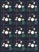

## the_royal/romac

[layout](romac-kle.json) - [PCB](romac.kicad_pcb)

{:loading="lazy"}

[Open in keyboard-layout-editor](http://www.keyboard-layout-editor.com/##@@_c=#505557&t=#d9d7d7;&=0,0&=0,1&=0,2;&@=1,0&=1,1&=1,2;&@=2,0&=2,1&=2,2;&@=3,0&=3,1&=3,2)

{:loading="lazy"}

