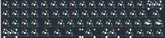
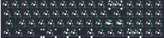

## tkc/candybar/candybar-lefty

[layout](candybar-lefty-kle.json) - [PCB](candybar-lefty.kicad_pcb)

{:loading="lazy"}

[Open in keyboard-layout-editor](http://www.keyboard-layout-editor.com/##@@=0,13&=0,14&=0,15&=0,16&_c=#777777;&=0,0&_c=#cccccc;&=0,1&=0,2&=0,3&=0,4&=0,5&=0,6&=0,7&=0,8&=0,9&=0,10&=0,11%0A%0A%0A0,0&=0,12%0A%0A%0A0,0;&@=1,13&=1,14&=1,15&=1,16&_c=#aaaaaa&w:1.25;&=1,0&_c=#cccccc;&=1,1&=1,2&=1,3&=1,4&=1,5&=1,6&=1,7&=1,8&=1,9&=1,10&_c=#777777&w:1.75;&=1,12;&@_c=#cccccc;&=2,13&=2,14&=2,15&=2,16&_c=#aaaaaa&w:1.75;&=2,0&_c=#cccccc;&=2,2&=2,3&=2,4&=2,5&=2,6&=2,7&=2,8&=2,9&=2,10&_c=#aaaaaa&w:1.25;&=2,11%0A%0A%0A1,0&_c=#777777;&=2,12%0A%0A%0A1,0;&@_c=#cccccc;&=3,13%0A%0A%0A3,0&=3,14%0A%0A%0A3,0&=3,15&=3,16&_c=#aaaaaa&w:1.25;&=3,0&_w:1.25;&=3,1&_w:1.25;&=3,2&_w:2.75;&=3,5%0A%0A%0A2,0&_w:2.25;&=3,8%0A%0A%0A2,0&_w:1.25;&=3,9%0A%0A%0A2,0&_c=#cccccc;&=3,10&_c=#777777;&=3,11&=3,12;&@_x:17.25&y:-4&c=#aaaaaa&w:2;&=0,12%0A%0A%0A0,1;&@_x:17.25&y:1&c=#777777;&=2,11%0A%0A%0A1,1&_c=#aaaaaa&w:1.25;&=2,12%0A%0A%0A1,1;&@_y:1.25&c=#cccccc&w:2;&=3,14%0A%0A%0A3,1&_x:1.75&c=#aaaaaa&w:6.25;&=3,7%0A%0A%0A2,1)

{:loading="lazy"}

## tkc/candybar/candybar-righty

[layout](candybar-righty-kle.json) - [PCB](candybar-righty.kicad_pcb)

{:loading="lazy"}

[Open in keyboard-layout-editor](http://www.keyboard-layout-editor.com/##@@_c=#777777;&=0,0&_c=#cccccc;&=0,1&=0,2&=0,3&=0,4&=0,5&=0,6&=0,7&=0,8&=0,9&=0,10&=0,11%0A%0A%0A0,0&=0,12%0A%0A%0A0,0&=0,13&=0,14&=0,15&=0,16;&@_c=#aaaaaa&w:1.25;&=1,0&_c=#cccccc;&=1,1&=1,2&=1,3&=1,4&=1,5&=1,6&=1,7&=1,8&=1,9&=1,10&_c=#777777&w:1.75;&=1,12&_c=#cccccc;&=1,13&=1,14&=1,15&=1,16;&@_c=#aaaaaa&w:1.75;&=2,0&_c=#cccccc;&=2,2&=2,3&=2,4&=2,5&=2,6&=2,7&=2,8&=2,9&=2,10&_c=#aaaaaa&w:1.25;&=2,11%0A%0A%0A1,0&_c=#777777;&=2,12%0A%0A%0A1,0&_c=#cccccc;&=2,13&=2,14&=2,15&=2,16;&@_c=#aaaaaa&w:1.25;&=3,0&_w:1.25;&=3,1&_w:1.25;&=3,2&_w:2.75;&=3,5%0A%0A%0A2,0&_w:2.25;&=3,8%0A%0A%0A2,0&_w:1.25;&=3,9%0A%0A%0A2,0&_c=#cccccc;&=3,10&_c=#777777;&=3,11&=3,12&=3,13%0A%0A%0A3,0&_c=#cccccc;&=3,14%0A%0A%0A3,0&=3,15&=3,16;&@_x:17.25&y:-4&c=#aaaaaa&w:2;&=0,12%0A%0A%0A0,1;&@_x:17.25&y:1&c=#777777;&=2,11%0A%0A%0A1,1&_c=#aaaaaa&w:1.25;&=2,12%0A%0A%0A1,1;&@_x:3.75&y:1.25&w:6.25;&=3,7%0A%0A%0A2,1&_x:3.0&c=#cccccc&w:2;&=3,14%0A%0A%0A3,1)

{:loading="lazy"}

