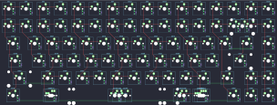

## tkc/godspeed75

[layout](godspeed75-kle.json) - [PCB](godspeed75.kicad_pcb)

{:loading="lazy"}

[Open in keyboard-layout-editor](http://www.keyboard-layout-editor.com/##@@=0,0&=1,0&=0,1&=1,1&=0,2&=1,2&=0,3&=1,3&=0,4&=1,4&=0,5&=1,5&=0,6&_c=#aaaaaa;&=1,6&=0,7&=1,7;&@_c=#cccccc;&=2,0&=3,0&=2,1&=3,1&=2,2&=3,2&=2,3&=3,3&=2,4&=3,4&=2,5&=3,5&=2,6&_c=#aaaaaa&w:2;&=2,7%0A%0A%0A0,0&=3,7;&@_w:1.5;&=4,0&_c=#cccccc;&=5,0&=4,1&=5,1&=4,2&=5,2&=4,3&=5,3&=4,4&=5,4&=4,5&=5,5&=4,6&_c=#aaaaaa&w:1.5;&=4,7&=5,7;&@_w:1.75;&=6,0&_c=#cccccc;&=7,0&=6,1&=7,1&=6,2&=7,2&=6,3&=7,3&=6,4&=7,4&=6,5&=7,5&_c=#777777&w:2.25;&=6,7&_c=#aaaaaa;&=7,7;&@_w:2.25;&=8,0&_c=#cccccc;&=8,1&=9,1&=8,2&=9,2&=8,3&=9,3&=8,4&=9,4&=8,5&=9,5&_c=#aaaaaa&w:1.75;&=9,6&_c=#777777;&=8,7&_c=#aaaaaa;&=9,7;&@_w:1.5;&=10,0&_x:0.75&w:1.25;&=10,1%0A%0A%0A1,0&_c=#cccccc&w:6.25;&=10,3%0A%0A%0A1,0&_c=#aaaaaa&w:1.25;&=10,5%0A%0A%0A1,0&_w:1.25;&=11,5%0A%0A%0A1,0&_x:0.75&c=#777777;&=11,6&=10,7&=11,7;&@_x:16.25&y:-5&c=#aaaaaa;&=3,6%0A%0A%0A0,1&=2,7%0A%0A%0A0,1;&@_x:2.25&y:4.25&w:1.5;&=10,1%0A%0A%0A1,1&_c=#cccccc&w:6.25;&=10,3%0A%0A%0A1,1&_c=#aaaaaa&w:1.25;&=10,5%0A%0A%0A1,1&=11,5%0A%0A%0A1,1;&@_x:2.25&y:0.25&w:1.5;&=10,1%0A%0A%0A1,2&_c=#cccccc&w:7;&=10,3%0A%0A%0A1,2&_c=#aaaaaa&w:1.5;&=11,5%0A%0A%0A1,2)

{:loading="lazy"}

