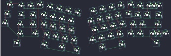

## tkc/osav2

[layout](osav2-kle.json) - [PCB](osav2.kicad_pcb)

{:loading="lazy"}

[Open in keyboard-layout-editor](http://www.keyboard-layout-editor.com/##@@_x:0.5&y:0.38&c=#777777;&=1,0&_x:2.25&c=#cccccc;&=0,2&_x:8.75;&=5,2;&@_x:1.75&y:-0.88&c=#aaaaaa;&=0,0&_c=#cccccc;&=0,1&_x:10.75;&=5,1&_c=#aaaaaa&w:2;&=5,7%0A%0A%0A0,0;&@_x:0.25&y:-0.12&c=#777777;&=2,0&_x:12.0&c=#cccccc;&=6,2;&@_x:1.5&y:-0.88&c=#aaaaaa&w:1.5;&=1,1&_c=#cccccc;&=1,2&_x:10.25;&=6,1&=6,0&_w:1.5;&=6,7;&@_y:-0.12&c=#777777;&=3,0;&@_x:1.25&y:-0.88&c=#aaaaaa&w:1.75;&=2,1&_c=#cccccc;&=2,2&_x:9.75;&=7,2&=7,1&_c=#777777&w:2.25;&=7,7;&@_x:1&c=#aaaaaa&w:2.25;&=3,1&_c=#cccccc;&=3,2&_x:9.25;&=8,2&=8,1&_c=#aaaaaa&w:2.75;&=8,7%0A%0A%0A1,0;&@_x:1&w:1.5;&=4,1&_x:13.5&w:1.5;&=9,0;&@_r:12&rx:4.75&ry:1.5&y:-1.0&c=#cccccc;&=0,3&=0,4&=0,5&=0,6;&@_x:-0.5;&=1,3&=1,4&=1,5&=1,6;&@_x:-0.25;&=2,3&=2,4&=2,5&=2,6;&@_x:0.25;&=3,3&=3,4&=3,5&=3,6;&@_x:1.5&w:2.25;&=4,5&_c=#aaaaaa;&=4,6;&@_y:-0.88&w:1.5;&=4,3;&@_r:-12&rx:14&ry:1.25&x:-4.5&y:-1.0&c=#cccccc;&=5,6&=5,5&=5,4&=5,3;&@_x:-5;&=6,6&=6,5&=6,4&=6,3;&@_x:-4.75;&=7,6&=7,5&=7,4&=7,3;&@_x:-5.25;&=8,6&=8,5&=8,4&=8,3;&@_x:-5.25&w:2.75;&=9,5;&@_x:-2.5&y:-0.87&c=#aaaaaa&w:1.5;&=9,3;&@_r:0&rx:0&ry:0&x:18.75&y:0.5;&=5,0%0A%0A%0A0,1&=5,7%0A%0A%0A0,1;&@_x:18.75&y:2.0&w:1.75;&=8,0%0A%0A%0A1,1&=8,7%0A%0A%0A1,1)

{:loading="lazy"}

