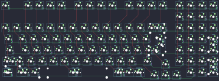

## tkc/tkc1800

[layout](tkc1800-kle.json) - [PCB](tkc1800.kicad_pcb)

{:loading="lazy"}

[Open in keyboard-layout-editor](http://www.keyboard-layout-editor.com/##@@_x:2.5&c=#aaaaaa;&=0,0&_x:1.0&c=#cccccc;&=0,2&=0,3&=0,4&=0,5&_x:0.5&c=#aaaaaa;&=0,6&=0,7&=0,8&=0,9&_x:0.5&c=#cccccc;&=0,10&=0,11&=0,12&=0,13&_x:0.5&c=#aaaaaa;&=0,15&=0,16&=0,17&=0,18;&@_x:18;&=1,15&=1,16&=1,17&=1,18;&@_x:2.5&c=#cccccc;&=2,0&=2,1&=2,2&=2,3&=2,4&=2,5&=2,6&=2,7&=2,8&=2,9&=2,10&=2,11&=2,12&_c=#aaaaaa&w:2;&=2,13%0A%0A%0A0,0&_x:0.5;&=2,15&=2,16&=2,17&=2,18;&@_x:2.5&w:1.5;&=3,0&_c=#cccccc;&=3,1&=3,2&=3,3&=3,4&=3,5&=3,6&=3,7&=3,8&=3,9&=3,10&=3,11&=3,12&_w:1.5;&=3,13%0A%0A%0A1,0&_x:0.5;&=3,15&=3,16&=3,17&_c=#aaaaaa;&=3,18%0A%0A%0A5,0;&@_x:2.5&w:1.75;&=4,0&_c=#cccccc;&=4,1&=4,2&=4,3&=4,4&=4,5&=4,6&=4,7&=4,8&=4,9&=4,10&=4,11&_c=#aaaaaa&w:2.25;&=4,13%0A%0A%0A1,0&_x:0.5&c=#cccccc;&=4,15&=4,16&=4,17&_c=#aaaaaa;&=4,18%0A%0A%0A5,0;&@_x:2.5&w:2.25;&=5,0%0A%0A%0A2,0&_c=#cccccc;&=5,2&=5,3&=5,4&=5,5&=5,6&=5,7&=5,8&=5,9&=5,10&=5,11&_c=#aaaaaa&w:1.75;&=5,12&_x:1.5&c=#cccccc;&=5,15&=5,16&=5,17&_c=#aaaaaa&h:2;&=6,18%0A%0A%0A6,0;&@_x:16.75&y:-0.75;&=5,13;&@_x:2.5&y:-0.25&w:1.5;&=6,0%0A%0A%0A3,0&_w:1.5;&=6,1%0A%0A%0A3,0&_c=#cccccc&w:7;&=6,5%0A%0A%0A3,0&_c=#aaaaaa&w:1.5;&=6,10%0A%0A%0A4,0&_w:1.5;&=6,11%0A%0A%0A4,0&_x:3.5&c=#cccccc;&=6,16&=6,17;&@_x:15.75&y:-0.75&c=#aaaaaa;&=6,12&=6,13&=6,14;&@_x:22.25&y:-5.25&c=#cccccc;&=2,13%0A%0A%0A0,1&=2,14%0A%0A%0A0,1;&@_x:23.25&c=#aaaaaa&w:1.25&h:2&w2:1.5&h2:1&x2:-0.25;&=4,13%0A%0A%0A1,1&_x:0.25&h:2;&=4,18%0A%0A%0A5,1;&@_x:22.25&c=#cccccc;&=4,12%0A%0A%0A1,1;&@_c=#aaaaaa&w:1.25;&=5,0%0A%0A%0A2,1&_c=#cccccc;&=5,1%0A%0A%0A2,1&_x:22.5&c=#aaaaaa;&=5,18%0A%0A%0A6,1;&@_x:24.75;&=6,18%0A%0A%0A6,1;&@_x:2.5&y:0.25&w:1.25;&=6,0%0A%0A%0A3,1&_w:1.25;&=6,1%0A%0A%0A3,1&_w:1.25;&=6,2%0A%0A%0A3,1&_c=#cccccc&w:6.25;&=6,5%0A%0A%0A3,1&_c=#aaaaaa;&=6,9%0A%0A%0A4,1&=6,10%0A%0A%0A4,1&=6,11%0A%0A%0A4,1)

{:loading="lazy"}

