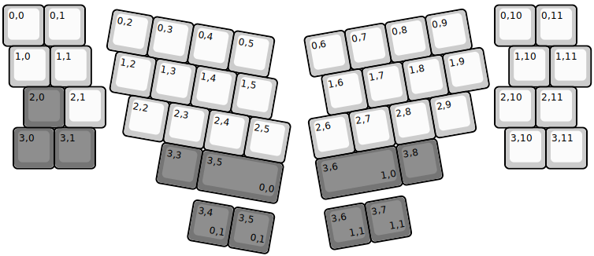
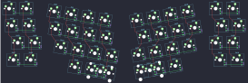
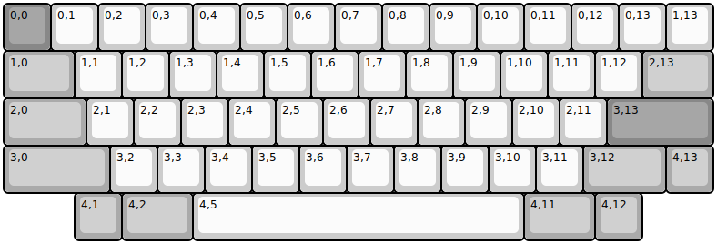
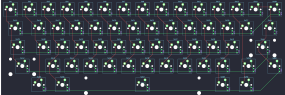

## tokyokeyboard/alix40

[layout](alix40-kle.json) - [PCB](alix40.kicad_pcb)

{:loading="lazy"}

[Open in keyboard-layout-editor](http://www.keyboard-layout-editor.com/##@@_y:0.05&f:1;&=0,0&=0,1&_x:10;&=0,10&=0,11;&@_x:0.15;&=1,0&=1,1&_x:10.2;&=1,10&=1,11;&@_x:0.5&c=#757575;&=2,0&_c=#cccccc;&=2,1&_x:9.5;&=2,10&=2,11;&@_x:0.25&c=#757575;&=3,0&=3,1&_x:10.0&c=#cccccc;&=3,10&=3,11;&@_r:10&rx:3&ry:4.25&x:-1&y:-4.0;&=0,2&=0,3&=0,4&=0,5;&@_x:-0.75;&=1,2&=1,3&=1,4&=1,5;&@_x:-0.25;&=2,2&=2,3&=2,4&=2,5;&@_x:0.75&c=#757575;&=3,3&_w:2;&=3,5%0A%0A%0A0,0;&@_r:-10&rx:12.5&x:-4.5&y:-4.25&c=#cccccc;&=0,6&=0,7&=0,8&=0,9;&@_x:-4.25;&=1,6&=1,7&=1,8&=1,9;&@_x:-4.75;&=2,6&=2,7&=2,8&=2,9;&@_x:-4.75&c=#757575&w:2;&=3,6%0A%0A%0A1,0&=3,8;&@_r:10&rx:3&x:1.75&y:0.25;&=3,4%0A%0A%0A0,1&=3,5%0A%0A%0A0,1;&@_r:-10&rx:12.5&x:-4.75;&=3,6%0A%0A%0A1,1&=3,7%0A%0A%0A1,1)

{:loading="lazy"}

## tokyokeyboard/tokyo60

[layout](tokyo60-kle.json) - [PCB](tokyo60.kicad_pcb)

{:loading="lazy"}

[Open in keyboard-layout-editor](http://www.keyboard-layout-editor.com/##@@_c=#888888;&=0,0&_c=#cccccc;&=0,1&=0,2&=0,3&=0,4&=0,5&=0,6&=0,7&=0,8&=0,9&=0,10&=0,11&=0,12&=0,13&=1,13;&@_c=#aaaaaa&w:1.5;&=1,0&_c=#cccccc;&=1,1&=1,2&=1,3&=1,4&=1,5&=1,6&=1,7&=1,8&=1,9&=1,10&=1,11&=1,12&_c=#aaaaaa&w:1.5;&=2,13;&@_w:1.75;&=2,0&_c=#cccccc;&=2,1&=2,2&=2,3&=2,4&=2,5&=2,6&=2,7&=2,8&=2,9&=2,10&=2,11&_c=#888888&w:2.25;&=3,13;&@_c=#aaaaaa&w:2.25;&=3,0&_c=#cccccc;&=3,2&=3,3&=3,4&=3,5&=3,6&=3,7&=3,8&=3,9&=3,10&=3,11&_c=#aaaaaa&w:1.75;&=3,12&=4,13;&@_x:1.5;&=4,1&_w:1.5;&=4,2&_c=#cccccc&w:7;&=4,5&_c=#aaaaaa&w:1.5;&=4,11&=4,12)

{:loading="lazy"}

