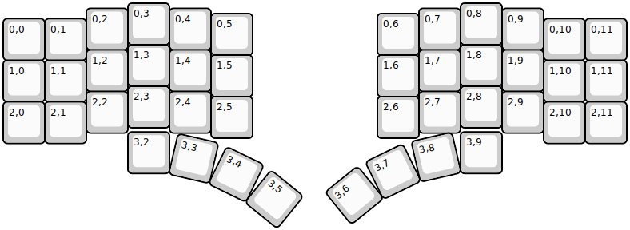
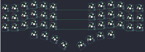

## torn/torn

[layout](torn-kle.json) - [PCB](torn.kicad_pcb)

{:loading="lazy"}

[Open in keyboard-layout-editor](http://www.keyboard-layout-editor.com/##@@_x:3;&=0,3&_x:7;&=0,8;&@_x:2&y:-0.875;&=0,2&_x:1;&=0,4&_x:5;&=0,7&_x:1;&=0,9;&@_x:5&y:-0.875;&=0,5&_x:3;&=0,6;&@_y:-0.875;&=0,0&=0,1&_x:11;&=0,10&=0,11;&@_x:3&y:-0.375;&=1,3&_x:7;&=1,8;&@_x:2&y:-0.875;&=1,2&_x:1;&=1,4&_x:5;&=1,7&_x:1;&=1,9;&@_x:5&y:-0.875;&=1,5&_x:3;&=1,6;&@_y:-0.875;&=1,0&=1,1&_x:11;&=1,10&=1,11;&@_x:3&y:-0.375;&=2,3&_x:7;&=2,8;&@_x:2&y:-0.875;&=2,2&_x:1;&=2,4&_x:5;&=2,7&_x:1;&=2,9;&@_x:5&y:-0.875;&=2,5&_x:3;&=2,6;&@_y:-0.875;&=2,0&=2,1&_x:11;&=2,10&=2,11;&@_x:3&y:-0.275;&=3,2&_x:7;&=3,9;&@_r:13&rx:3.5&ry:8.5&x:-0.5&y:-5.4;&=3,3;&@_r:26&x:-0.5&y:-1.0;&=3,4;&@_r:39&x:-0.5&y:-1.0;&=3,5;&@_r:-39&rx:11.5&x:-0.5&y:-5.4;&=3,6;&@_r:-26&x:-0.5&y:-1.0;&=3,7;&@_r:-13&x:-0.5&y:-1.0;&=3,8)

{:loading="lazy"}

