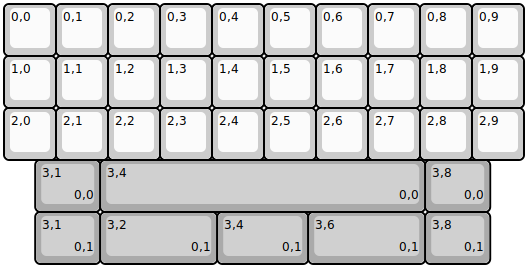
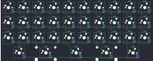

## underscore33/Rev1/underscore33_rev1

[layout](underscore33_rev1-kle.json) - [PCB](underscore33_rev1.kicad_pcb)

{:loading="lazy"}

[Open in keyboard-layout-editor](http://www.keyboard-layout-editor.com/##@@=0,0&=0,1&=0,2&=0,3&=0,4&=0,5&=0,6&=0,7&=0,8&=0,9;&@=1,0&=1,1&=1,2&=1,3&=1,4&=1,5&=1,6&=1,7&=1,8&=1,9;&@=2,0&=2,1&=2,2&=2,3&=2,4&=2,5&=2,6&=2,7&=2,8&=2,9;&@_x:0.6&c=#aaaaaa&w:1.25;&=3,1%0A%0A%0A0,0&_w:6.25;&=3,4%0A%0A%0A0,0&_w:1.25;&=3,8%0A%0A%0A0,0;&@_x:0.6&w:1.25;&=3,1%0A%0A%0A0,1&_w:2.25;&=3,2%0A%0A%0A0,1&_w:1.75;&=3,4%0A%0A%0A0,1&_w:2.25;&=3,6%0A%0A%0A0,1&_w:1.25;&=3,8%0A%0A%0A0,1)

{:loading="lazy"}

