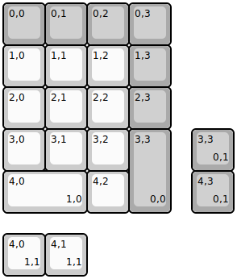
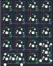

## ungodly/launch_pad

[layout](launch_pad-kle.json) - [PCB](launch_pad.kicad_pcb)

{:loading="lazy"}

[Open in keyboard-layout-editor](http://www.keyboard-layout-editor.com/##@@_c=#aaaaaa;&=0,0&=0,1&=0,2&=0,3;&@_c=#cccccc;&=1,0&=1,1&=1,2&_c=#aaaaaa;&=1,3;&@_c=#cccccc;&=2,0&=2,1&=2,2&_c=#aaaaaa;&=2,3;&@_c=#cccccc;&=3,0&=3,1&=3,2&_c=#aaaaaa&h:2;&=3,3%0A%0A%0A0,0;&@_c=#cccccc&w:2;&=4,0%0A%0A%0A1,0&=4,2;&@_x:4.5&y:-2&c=#aaaaaa;&=3,3%0A%0A%0A0,1;&@_x:4.5;&=4,3%0A%0A%0A0,1;&@_y:0.5&c=#cccccc;&=4,0%0A%0A%0A1,1&=4,1%0A%0A%0A1,1)

{:loading="lazy"}

