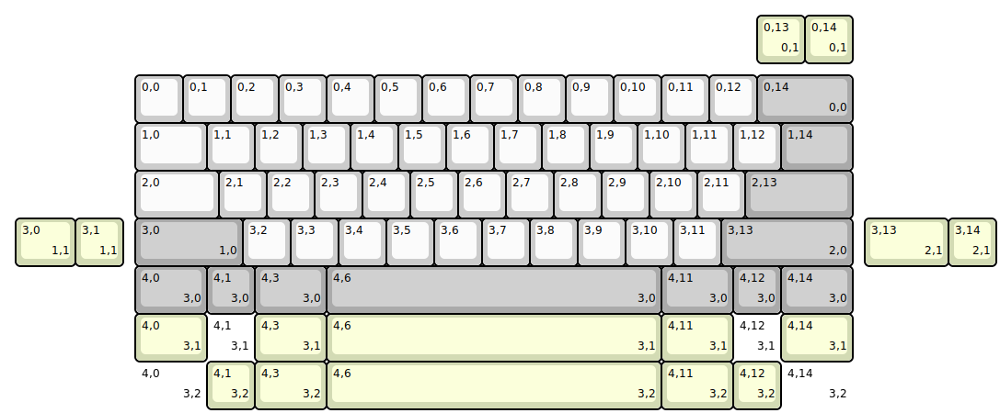
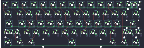

## vertex/arc60h

[layout](arc60h-kle.json) - [PCB](arc60h.kicad_pcb)

{:loading="lazy"}

[Open in keyboard-layout-editor](http://www.keyboard-layout-editor.com/##@@_x:2.75&y:1.5;&=0,0&=0,1&=0,2&=0,3&=0,4&=0,5&=0,6&=0,7&=0,8&=0,9&=0,10&=0,11&=0,12&_c=#aaaaaa&w:2;&=0,14%0A%0A%0A0,0;&@_x:2.75&c=#cccccc&w:1.5;&=1,0&=1,1&=1,2&=1,3&=1,4&=1,5&=1,6&=1,7&=1,8&=1,9&=1,10&=1,11&=1,12&_c=#aaaaaa&w:1.5;&=1,14;&@_x:2.75&c=#cccccc&w:1.75;&=2,0&=2,1&=2,2&=2,3&=2,4&=2,5&=2,6&=2,7&=2,8&=2,9&=2,10&=2,11&_c=#aaaaaa&w:2.25;&=2,13;&@_x:2.75&w:2.25;&=3,0%0A%0A%0A1,0&_c=#cccccc;&=3,2&=3,3&=3,4&=3,5&=3,6&=3,7&=3,8&=3,9&=3,10&=3,11&_c=#aaaaaa&w:2.75;&=3,13%0A%0A%0A2,0;&@_x:2.75&w:1.5;&=4,0%0A%0A%0A3,0&=4,1%0A%0A%0A3,0&_w:1.5;&=4,3%0A%0A%0A3,0&_w:7;&=4,6%0A%0A%0A3,0&_w:1.5;&=4,11%0A%0A%0A3,0&=4,12%0A%0A%0A3,0&_w:1.5;&=4,14%0A%0A%0A3,0;&@_x:15.75&y:-6.25&c=#d3dbb4;&=0,13%0A%0A%0A0,1&=0,14%0A%0A%0A0,1;&@_x:0.25&y:3.25&w:1.25;&=3,0%0A%0A%0A1,1&=3,1%0A%0A%0A1,1&_x:15.5&w:1.75;&=3,13%0A%0A%0A2,1&=3,14%0A%0A%0A2,1;&@_x:2.75&y:1.0&w:1.5;&=4,0%0A%0A%0A3,1&_c=#cccccc&d:true;&=4,1%0A%0A%0A3,1&_c=#d3dbb4&w:1.5;&=4,3%0A%0A%0A3,1&_w:7;&=4,6%0A%0A%0A3,1&_w:1.5;&=4,11%0A%0A%0A3,1&_c=#cccccc&d:true;&=4,12%0A%0A%0A3,1&_c=#d3dbb4&w:1.5;&=4,14%0A%0A%0A3,1;&@_x:2.75&c=#cccccc&w:1.5&d:true;&=4,0%0A%0A%0A3,2&_c=#d3dbb4;&=4,1%0A%0A%0A3,2&_w:1.5;&=4,3%0A%0A%0A3,2&_w:7;&=4,6%0A%0A%0A3,2&_w:1.5;&=4,11%0A%0A%0A3,2&=4,12%0A%0A%0A3,2&_c=#cccccc&w:1.5&d:true;&=4,14%0A%0A%0A3,2)

{:loading="lazy"}

