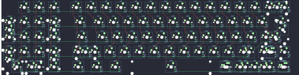

## viendi/viendi8l

[layout](viendi8l-kle.json) - [PCB](viendi8l.kicad_pcb)

{:loading="lazy"}

[Open in keyboard-layout-editor](http://www.keyboard-layout-editor.com/##@@_x:1;&=0,1%0A%0A%0A5,0&=0,2%0A%0A%0A5,0&=0,3%0A%0A%0A5,0&_x:0.5&c=#777777;&=0,4&_c=#cccccc;&=0,5&=0,6&=0,7&=0,8&=0,9&=0,10&=0,11&=0,12&=0,13&=0,14&=0,15&=0,16&_c=#aaaaaa&w:2;&=0,17%0A%0A%0A0,0;&@_c=#cccccc&h:2;&=1,0%0A%0A%0A5,0&=1,1%0A%0A%0A5,0&=1,2%0A%0A%0A5,0&=1,3%0A%0A%0A5,0&_x:0.5&c=#aaaaaa&w:1.5;&=1,4&_c=#cccccc;&=1,5&=1,6&=1,7&=1,8&=1,9&=1,10&=1,11&=1,12&=1,13&=1,14&=1,15&=1,16&_w:1.5;&=1,17%0A%0A%0A3,0;&@_x:1;&=2,1%0A%0A%0A5,0&=2,2%0A%0A%0A5,0&=2,3%0A%0A%0A5,0&_x:0.5&c=#aaaaaa&w:1.75;&=2,4&_c=#cccccc;&=2,5&=2,6&=2,7&=2,8&=2,9&=2,10&=2,11&=2,12&=2,13&=2,14&=2,15&_c=#777777&w:2.25;&=2,16%0A%0A%0A3,0;&@_c=#cccccc&h:2;&=3,0%0A%0A%0A5,0&=3,1%0A%0A%0A5,0&=3,2%0A%0A%0A5,0&=3,3%0A%0A%0A5,0&_x:0.5&c=#aaaaaa&w:2.25;&=3,4%0A%0A%0A4,0&_c=#cccccc;&=3,6&=3,7&=3,8&=3,9&=3,10&=3,11&=3,12&=3,13&=3,14&=3,15%0A%0A%0A2,0&_c=#aaaaaa&w:2.75;&=3,16%0A%0A%0A2,0;&@_x:1&c=#cccccc&w:2;&=4,2%0A%0A%0A5,0&=4,3%0A%0A%0A5,0&_x:0.5&c=#aaaaaa&w:1.25;&=4,4&_w:1.25;&=4,6&_w:1.25;&=4,7&_c=#cccccc&w:6.25;&=5,10&=5,12%0A%0A%0A1,0&_c=#777777;&=5,13%0A%0A%0A1,0&=5,14%0A%0A%0A1,0&=5,15%0A%0A%0A1,0&=5,16%0A%0A%0A1,0;&@_x:20.25&y:-5&c=#cccccc;&=0,17%0A%0A%0A0,1&=2,17%0A%0A%0A0,1;&@_x:21.0&c=#777777&w:1.25&h:2&w2:1.5&h2:1&x2:-0.25;&=2,16%0A%0A%0A3,1;&@_x:20.0&c=#cccccc;&=3,17%0A%0A%0A3,1;&@_x:20.0&c=#aaaaaa&w:1.75;&=3,15%0A%0A%0A2,1&_c=#cccccc;&=3,16%0A%0A%0A2,1&=5,17%0A%0A%0A2,1&_x:0.75;&=3,15%0A%0A%0A2,2&_c=#aaaaaa&w:1.75;&=3,16%0A%0A%0A2,2&_c=#cccccc;&=5,17%0A%0A%0A2,2;&@_x:1&y:1.25;&=0,1%0A%0A%0A5,1&=0,2%0A%0A%0A5,1&=0,3%0A%0A%0A5,1&_x:0.5&c=#aaaaaa&w:1.25;&=3,4%0A%0A%0A4,1&_c=#cccccc;&=3,5%0A%0A%0A4,1&_x:7.75&c=#aaaaaa&w:1.25;&=5,12%0A%0A%0A1,1&_w:1.25;&=5,13%0A%0A%0A1,1&_w:1.25;&=5,15%0A%0A%0A1,1&_w:1.25;&=5,16%0A%0A%0A1,1;&@_c=#cccccc;&=1,0%0A%0A%0A5,1&=1,1%0A%0A%0A5,1&=1,2%0A%0A%0A5,1&_h:2;&=2,3%0A%0A%0A5,1;&@=2,0%0A%0A%0A5,1&=2,1%0A%0A%0A5,1&=2,2%0A%0A%0A5,1;&@=3,0%0A%0A%0A5,1&=3,1%0A%0A%0A5,1&=3,2%0A%0A%0A5,1&_h:2;&=3,3%0A%0A%0A5,1;&@_w:2;&=4,1%0A%0A%0A5,1&=4,2%0A%0A%0A5,1)

{:loading="lazy"}

