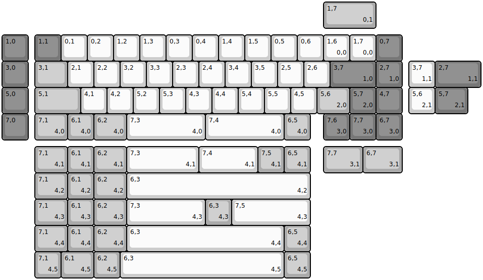
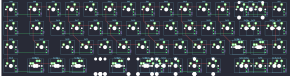

## viktus/smolka

[layout](smolka-kle.json) - [PCB](smolka.kicad_pcb)

{:loading="lazy"}

[Open in keyboard-layout-editor](http://www.keyboard-layout-editor.com/##@@_y:1.25&c=#777777;&=1,0&_x:0.25;&=1,1&_c=#cccccc;&=0,1&=0,2&=1,2&=1,3&=0,3&=0,4&=1,4&=1,5&=0,5&=0,6&=1,6%0A%0A%0A0,0&=1,7%0A%0A%0A0,0&_c=#777777;&=0,7;&@=3,0&_x:0.25&c=#aaaaaa&w:1.25;&=3,1&_c=#cccccc;&=2,1&=2,2&=3,2&=3,3&=2,3&=2,4&=3,4&=3,5&=2,5&=2,6&_c=#777777&w:1.75;&=3,7%0A%0A%0A1,0&=2,7%0A%0A%0A1,0;&@=5,0&_x:0.25&c=#aaaaaa&w:1.75;&=5,1&_c=#cccccc;&=4,1&=4,2&=5,2&=5,3&=4,3&=4,4&=5,4&=5,5&=4,5&_c=#aaaaaa&w:1.25;&=5,6%0A%0A%0A2,0&_c=#777777;&=5,7%0A%0A%0A2,0&=4,7;&@=7,0&_x:0.25&c=#aaaaaa&w:1.25;&=7,1%0A%0A%0A4,0&=6,1%0A%0A%0A4,0&_w:1.25;&=6,2%0A%0A%0A4,0&_c=#cccccc&w:3;&=7,3%0A%0A%0A4,0&_w:3;&=7,4%0A%0A%0A4,0&_c=#aaaaaa;&=6,5%0A%0A%0A4,0&_x:0.5&c=#777777;&=7,6%0A%0A%0A3,0&=7,7%0A%0A%0A3,0&=6,7%0A%0A%0A3,0;&@_x:12.25&y:-5.25&c=#aaaaaa&w:2;&=1,7%0A%0A%0A0,1;&@_x:15.5&y:1.25&c=#cccccc;&=3,7%0A%0A%0A1,1&_c=#777777&w:1.75;&=2,7%0A%0A%0A1,1;&@_x:15.5&c=#cccccc;&=5,6%0A%0A%0A2,1&_c=#777777&w:1.25;&=5,7%0A%0A%0A2,1;&@_x:1.25&y:1.25&c=#aaaaaa&w:1.25;&=7,1%0A%0A%0A4,1&=6,1%0A%0A%0A4,1&_w:1.25;&=6,2%0A%0A%0A4,1&_c=#cccccc&w:2.75;&=7,3%0A%0A%0A4,1&_w:2.25;&=7,4%0A%0A%0A4,1&_c=#aaaaaa;&=7,5%0A%0A%0A4,1&=6,5%0A%0A%0A4,1&_x:0.5&w:1.5;&=7,7%0A%0A%0A3,1&_w:1.5;&=6,7%0A%0A%0A3,1;&@_x:1.25&w:1.25;&=7,1%0A%0A%0A4,2&=6,1%0A%0A%0A4,2&_w:1.25;&=6,2%0A%0A%0A4,2&_c=#cccccc&w:7;&=6,3%0A%0A%0A4,2;&@_x:1.25&c=#aaaaaa&w:1.25;&=7,1%0A%0A%0A4,3&=6,1%0A%0A%0A4,3&_w:1.25;&=6,2%0A%0A%0A4,3&_c=#cccccc&w:3;&=7,3%0A%0A%0A4,3&_c=#aaaaaa;&=6,3%0A%0A%0A4,3&_c=#cccccc&w:3;&=7,5%0A%0A%0A4,3;&@_x:1.25&c=#aaaaaa&w:1.25;&=7,1%0A%0A%0A4,4&=6,1%0A%0A%0A4,4&_w:1.25;&=6,2%0A%0A%0A4,4&_c=#cccccc&w:6;&=6,3%0A%0A%0A4,4&_c=#aaaaaa;&=6,5%0A%0A%0A4,4;&@_x:1.25;&=7,1%0A%0A%0A4,5&_w:1.25;&=6,1%0A%0A%0A4,5&=6,2%0A%0A%0A4,5&_c=#cccccc&w:6.25;&=6,3%0A%0A%0A4,5&_c=#aaaaaa;&=6,5%0A%0A%0A4,5)

{:loading="lazy"}

