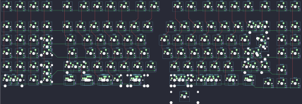

## viktus/sp111

[layout](sp111-kle.json) - [PCB](sp111.kicad_pcb)

{:loading="lazy"}

[Open in keyboard-layout-editor](http://www.keyboard-layout-editor.com/##@@_x:1.25;&=0,0&=0,1&=0,2&=0,3&_x:0.5&c=#777777;&=0,4&_x:0.25&c=#cccccc;&=0,5&=0,6&=0,7&=0,8&_x:0.25;&=0,9&=0,10&_x:0.75;&=6,1&=6,2&_x:0.25;&=6,3&=6,4&=6,5&=6,6&_x:0.25;&=6,7&_x:0.25;&=6,8&=6,9;&@_x:1.25&y:0.5;&=1,0&=1,1&=1,2&=1,3&_x:0.5;&=1,4&=1,5&=1,6&=1,7&=1,8&=1,9&=1,10&_x:0.75;&=7,0&=7,1&=7,2&=7,3&=7,4&=7,5&_c=#aaaaaa&w:2;&=7,7%0A%0A%0A0,0&_x:0.25&c=#cccccc;&=7,8&=7,9;&@_x:1.25;&=2,0&=2,1&=2,2&_h:2;&=3,3%0A%0A%0A6,0&_x:0.5&c=#aaaaaa&w:1.5;&=2,4&_c=#cccccc;&=2,5&=2,6&=2,7&=2,8&=2,9&_x:0.75;&=8,0&=8,1&=8,2&=8,3&=8,4&=8,5&=8,6&_w:1.5;&=8,7%0A%0A%0A1,0&_x:0.25;&=8,8&=8,9;&@_x:1.25;&=3,0&=3,1&=3,2&_x:1.5&c=#aaaaaa&w:1.75&l:true;&=3,4&_c=#cccccc;&=3,5&=3,6&=3,7&=3,8&=3,9&_x:0.75;&=9,0&=9,1&=9,2&=9,3&=9,4&=9,5&_c=#777777&w:2.25;&=9,7%0A%0A%0A1,0&_x:0.25&c=#cccccc;&=9,8&=9,9;&@_x:1.25;&=4,0&=4,1&=4,2&_h:2;&=4,3%0A%0A%0A7,0&_x:0.5&c=#aaaaaa&w:2.25;&=4,4%0A%0A%0A2,0&_c=#cccccc;&=4,6&=4,7&=4,8&=4,9&=4,10&_x:0.75;&=10,1&=10,2&=10,3&=10,4&=10,5&_c=#aaaaaa&w:2.75;&=10,6%0A%0A%0A3,0;&@_x:21.75&y:-0.75&c=#cccccc;&=10,8;&@_x:1.25&y:-0.25&w:2;&=5,1%0A%0A%0A8,0&=5,2&_x:1.5&c=#aaaaaa&w:1.5;&=5,4%0A%0A%0A4,0&_w:1.25;&=5,5%0A%0A%0A4,0&_w:1.5;&=5,6%0A%0A%0A4,0&_c=#cccccc&w:2.75;&=5,8%0A%0A%0A4,0&_x:0.75&w:2.75;&=11,2%0A%0A%0A5,0&_c=#aaaaaa&w:1.5;&=11,4%0A%0A%0A5,0&_w:1.25;&=11,5%0A%0A%0A5,0&_w:1.5;&=11,6%0A%0A%0A5,0;&@_x:20.75&y:-0.75&c=#cccccc;&=11,7&=11,8&=11,9;&@_y:-4.25;&=2,3%0A%0A%0A6,1&_x:24.5&c=#777777&w:1.25&h:2&w2:1.5&h2:1&x2:-0.25;&=9,7%0A%0A%0A1,1;&@_c=#cccccc;&=3,3%0A%0A%0A6,1&_x:23.5;&=9,6%0A%0A%0A1,1;&@=4,3%0A%0A%0A7,1&_x:23.0&c=#aaaaaa&w:1.75;&=10,6%0A%0A%0A3,1&_c=#cccccc;&=10,7%0A%0A%0A3,1;&@=5,3%0A%0A%0A7,1;&@_x:1&y:0.25;&=5,0%0A%0A%0A8,1&=5,1%0A%0A%0A8,1&_x:0.25&c=#aaaaaa&w:1.25;&=4,4%0A%0A%0A2,1&_c=#cccccc;&=4,5%0A%0A%0A2,1&_x:0.25&c=#aaaaaa&w:1.25;&=5,4%0A%0A%0A4,1&_w:1.25;&=5,5%0A%0A%0A4,1&_w:1.25;&=5,6%0A%0A%0A4,1&_c=#cccccc;&=5,7%0A%0A%0A4,1&_w:2.25;&=5,8%0A%0A%0A4,1&_x:0.75&w:2.25;&=11,2%0A%0A%0A5,1&=11,3%0A%0A%0A5,1&_c=#aaaaaa&w:1.25;&=11,4%0A%0A%0A5,1&_w:1.25;&=11,5%0A%0A%0A5,1&_w:1.25;&=11,6%0A%0A%0A5,1;&@_x:5.75&y:0.25&w:1.5;&=5,4%0A%0A%0A4,2&=5,5%0A%0A%0A4,2&_w:1.5;&=5,6%0A%0A%0A4,2&_c=#cccccc&w:3;&=5,8%0A%0A%0A4,2&_x:0.75&w:3;&=11,2%0A%0A%0A5,1&_c=#aaaaaa&w:1.5;&=11,4%0A%0A%0A5,2&=11,5%0A%0A%0A5,2&_w:1.5;&=11,6%0A%0A%0A5,2;&@_rx:0.5&x:24.25&y:1.5&c=#cccccc;&=7,6%0A%0A%0A0,1&=7,7%0A%0A%0A0,1)

{:loading="lazy"}

