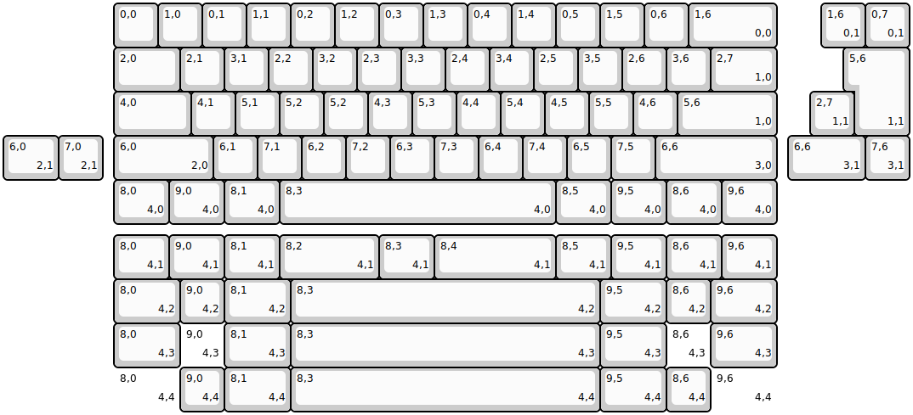
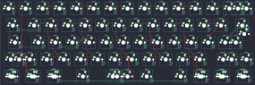

## wekey/polaris/polaris_ex

[layout](polaris_ex-kle.json) - [PCB](polaris_ex.kicad_pcb)

{:loading="lazy"}

[Open in keyboard-layout-editor](http://www.keyboard-layout-editor.com/##@@_x:2.5;&=0,0&=1,0&=0,1&=1,1&=0,2&=1,2&=0,3&=1,3&=0,4&=1,4&=0,5&=1,5&=0,6&_w:2;&=1,6%0A%0A%0A0,0;&@_x:2.5&w:1.5;&=2,0&=2,1&=3,1&=2,2&=3,2&=2,3&=3,3&=2,4&=3,4&=2,5&=3,5&=2,6&=3,6&_w:1.5;&=2,7%0A%0A%0A1,0;&@_x:2.5&w:1.75;&=4,0&=4,1&=5,1&=5,2&=5,2&=4,3&=5,3&=4,4&=5,4&=4,5&=5,5&=4,6&_w:2.25;&=5,6%0A%0A%0A1,0;&@_x:2.5&w:2.25;&=6,0%0A%0A%0A2,0&=6,1&=7,1&=6,2&=7,2&=6,3&=7,3&=6,4&=7,4&=6,5&=7,5&_w:2.75;&=6,6%0A%0A%0A3,0;&@_x:2.5&w:1.25;&=8,0%0A%0A%0A4,0&_w:1.25;&=9,0%0A%0A%0A4,0&_w:1.25;&=8,1%0A%0A%0A4,0&_w:6.25;&=8,3%0A%0A%0A4,0&_w:1.25;&=8,5%0A%0A%0A4,0&_w:1.25;&=9,5%0A%0A%0A4,0&_w:1.25;&=8,6%0A%0A%0A4,0&_w:1.25;&=9,6%0A%0A%0A4,0;&@_x:18.5&y:-5;&=1,6%0A%0A%0A0,1&=0,7%0A%0A%0A0,1;&@_x:19.25&w:1.25&h:2&w2:1.5&h2:1&x2:-0.25;&=5,6%0A%0A%0A1,1;&@_x:18.25;&=2,7%0A%0A%0A1,1;&@_w:1.25;&=6,0%0A%0A%0A2,1&=7,0%0A%0A%0A2,1&_x:15.5&w:1.75;&=6,6%0A%0A%0A3,1&=7,6%0A%0A%0A3,1;&@_x:2.5&y:1.25&w:1.25;&=8,0%0A%0A%0A4,1&_w:1.25;&=9,0%0A%0A%0A4,1&_w:1.25;&=8,1%0A%0A%0A4,1&_w:2.25;&=8,2%0A%0A%0A4,1&_w:1.25;&=8,3%0A%0A%0A4,1&_w:2.75;&=8,4%0A%0A%0A4,1&_w:1.25;&=8,5%0A%0A%0A4,1&_w:1.25;&=9,5%0A%0A%0A4,1&_w:1.25;&=8,6%0A%0A%0A4,1&_w:1.25;&=9,6%0A%0A%0A4,1;&@_x:2.5&w:1.5;&=8,0%0A%0A%0A4,2&=9,0%0A%0A%0A4,2&_w:1.5;&=8,1%0A%0A%0A4,2&_w:7;&=8,3%0A%0A%0A4,2&_w:1.5;&=9,5%0A%0A%0A4,2&=8,6%0A%0A%0A4,2&_w:1.5;&=9,6%0A%0A%0A4,2;&@_x:2.5&w:1.5;&=8,0%0A%0A%0A4,3&_d:true;&=9,0%0A%0A%0A4,3&_w:1.5;&=8,1%0A%0A%0A4,3&_w:7;&=8,3%0A%0A%0A4,3&_w:1.5;&=9,5%0A%0A%0A4,3&_d:true;&=8,6%0A%0A%0A4,3&_w:1.5;&=9,6%0A%0A%0A4,3;&@_x:2.5&w:1.5&d:true;&=8,0%0A%0A%0A4,4&=9,0%0A%0A%0A4,4&_w:1.5;&=8,1%0A%0A%0A4,4&_w:7;&=8,3%0A%0A%0A4,4&_w:1.5;&=9,5%0A%0A%0A4,4&=8,6%0A%0A%0A4,4&_w:1.5&d:true;&=9,6%0A%0A%0A4,4)

{:loading="lazy"}

