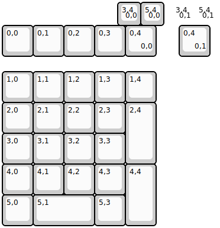
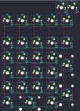

## wekey/we27/we27v1

[layout](we27v1-kle.json) - [PCB](we27v1.kicad_pcb)

{:loading="lazy"}

[Open in keyboard-layout-editor](http://www.keyboard-layout-editor.com/##@@_x:3.75&w:0.75&h:0.75;&=3,4%0A%0A%0A0,0&_w:0.75&h:0.75;&=5,4%0A%0A%0A0,0;&@_y:-0.25;&=0,0&=0,1&=0,2&=0,3&=0,4%0A%0A%0A0,0;&@_y:0.5;&=1,0&=1,1&=1,2&=1,3&=1,4;&@=2,0&=2,1&=2,2&=2,3&_h:2;&=2,4;&@=3,0&=3,1&=3,2&=3,3;&@=4,0&=4,1&=4,2&=4,3&_h:2;&=4,4;&@=5,0&_w:2;&=5,1&=5,3;&@_x:5.5&y:-7.25&w:0.75&h:0.75&d:true;&=3,4%0A%0A%0A0,1&_w:0.75&h:0.75&d:true;&=5,4%0A%0A%0A0,1;&@_x:5.75&y:-0.25;&=0,4%0A%0A%0A0,1)

{:loading="lazy"}

