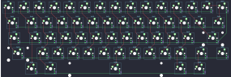

## wilba_tech/rama_works_kara

[layout](rama_works_kara-kle.json) - [PCB](rama_works_kara.kicad_pcb)

{:loading="lazy"}

[Open in keyboard-layout-editor](http://www.keyboard-layout-editor.com/##@@_c=#4d525a&t=#e2e2e2;&=0,0&_c=#e2e2e2&t=#363636;&=0,1&=0,2&=0,3&=0,4&=0,5&=0,6&=0,7&=0,8&=0,9&=0,10&=0,11&=0,12&=0,13&_c=#4d525a&t=#e2e2e2;&=2,13;&@_w:1.5;&=1,0&_c=#e2e2e2&t=#363636;&=1,1&=1,2&=1,3&=1,4&=1,5&=1,6&=1,7&=1,8&=1,9&=1,10&=1,11&=1,12&_c=#4d525a&t=#e2e2e2&w:1.5;&=1,13;&@_c=#f5cb01&t=#4d525a&w:1.75;&=2,0&_c=#e2e2e2&t=#363636;&=2,1&=2,2&=2,3&=2,4&=2,5&=2,6&=2,7&=2,8&=2,9&=2,10&=2,11&_c=#4d525a&t=#e2e2e2&w:2.25;&=2,12;&@_w:2.25;&=3,0&_c=#e2e2e2&t=#363636;&=3,2&=3,3&=3,4&=3,5&=3,6&=3,7&=3,8&=3,9&=3,10&=3,11&_c=#4d525a&t=#e2e2e2&w:1.75;&=3,12&_c=#f5cb01&t=#4d525a;&=3,13;&@_x:1.5&c=#4d525a&t=#e2e2e2;&=4,1&_w:1.5;&=4,2&_c=#e2e2e2&t=#363636&w:7;&=4,7&_c=#4d525a&t=#e2e2e2&w:1.5;&=4,11&=4,12)

{:loading="lazy"}

