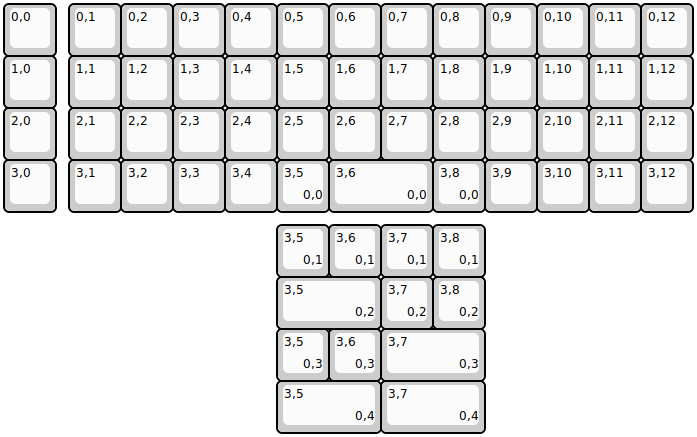

## wilba_tech/rama_works_m50_ax

[layout](rama_works_m50_ax-kle.json) - [PCB](rama_works_m50_ax.kicad_pcb)

{:loading="lazy"}

[Open in keyboard-layout-editor](http://www.keyboard-layout-editor.com/##@@=0,0&_x:0.25;&=0,1&=0,2&=0,3&=0,4&=0,5&=0,6&=0,7&=0,8&=0,9&=0,10&=0,11&=0,12;&@=1,0&_x:0.25;&=1,1&=1,2&=1,3&=1,4&=1,5&=1,6&=1,7&=1,8&=1,9&=1,10&=1,11&=1,12;&@=2,0&_x:0.25;&=2,1&=2,2&=2,3&=2,4&=2,5&=2,6&=2,7&=2,8&=2,9&=2,10&=2,11&=2,12;&@=3,0&_x:0.25;&=3,1&=3,2&=3,3&=3,4&=3,5%0A%0A%0A0,0&_w:2;&=3,6%0A%0A%0A0,0&=3,8%0A%0A%0A0,0&=3,9&=3,10&=3,11&=3,12;&@_x:5.25&y:0.25;&=3,5%0A%0A%0A0,1&=3,6%0A%0A%0A0,1&=3,7%0A%0A%0A0,1&=3,8%0A%0A%0A0,1;&@_x:5.25&w:2;&=3,5%0A%0A%0A0,2&=3,7%0A%0A%0A0,2&=3,8%0A%0A%0A0,2;&@_x:5.25;&=3,5%0A%0A%0A0,3&=3,6%0A%0A%0A0,3&_w:2;&=3,7%0A%0A%0A0,3;&@_x:5.25&w:2;&=3,5%0A%0A%0A0,4&_w:2;&=3,7%0A%0A%0A0,4)

{:loading="lazy"}

