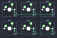

## wilba_tech/rama_works_m6_a

[layout](rama_works_m6_a-kle.json) - [PCB](rama_works_m6_a.kicad_pcb)

{:loading="lazy"}

[Open in keyboard-layout-editor](http://www.keyboard-layout-editor.com/##@@_c=#505557&t=#d9d7d7;&=0,0&=0,1&=0,2;&@=0,3&=0,4&=0,5)

{:loading="lazy"}

