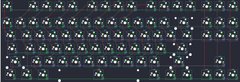

## wilba_tech/rama_works_u80_a

[layout](rama_works_u80_a-kle.json) - [PCB](rama_works_u80_a.kicad_pcb)

{:loading="lazy"}

[Open in keyboard-layout-editor](http://www.keyboard-layout-editor.com/##@@_c=#afb0ae&t=#505557;&=0,0&_x:1&c=#505557&t=#aeb0b0;&=0,1&=0,2&=0,3&=0,4&_x:0.5&c=#6b7173;&=0,5&=0,6&=0,7&=0,8&_x:0.5&c=#505557;&=0,9&=0,10&=0,11&=0,12&_x:0.25&c=#6b7173;&=0,14&=0,15&=0,16;&@_y:0.25;&=1,0&_c=#505557;&=1,1&=1,2&=1,3&=1,4&=1,5&=1,6&=1,7&=1,8&=1,9&=1,10&=1,11&=1,12&_c=#6b7173&w:2;&=1,13&_x:0.25;&=1,14&=1,15&=1,16;&@_w:1.5;&=2,0&_c=#505557;&=2,1&=2,2&=2,3&=2,4&=2,5&=2,6&=2,7&=2,8&=2,9&=2,10&=2,11&=2,12&_c=#6b7173&w:1.5;&=2,13&_x:0.25;&=2,14&=2,15&=2,16;&@_w:1.75;&=3,0&_c=#505557;&=3,1&=3,2&=3,3&=3,4&=3,5&=3,6&=3,7&=3,8&=3,9&=3,10&=3,11&_c=#afb0ae&t=#505557&w:2.25;&=3,12;&@_c=#6b7173&t=#aeb0b0&w:2.25;&=4,0&_c=#505557;&=4,2&=4,3&=4,4&=4,5&=4,6&=4,7&=4,8&=4,9&=4,10&=4,11&_c=#6b7173&w:2.75;&=4,12&_x:1.25;&=4,15;&@_w:1.5;&=5,0&=5,1&_w:1.5;&=5,2&_c=#505557&w:7;&=5,7&_c=#6b7173&w:1.5;&=5,11&=5,12&_w:1.5;&=5,13&_x:0.25;&=5,14&=5,15&=5,16)

{:loading="lazy"}

