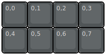

## wilba_tech/wt8_a

[layout](wt8_a-kle.json) - [PCB](wt8_a.kicad_pcb)

{:loading="lazy"}

[Open in keyboard-layout-editor](http://www.keyboard-layout-editor.com/##@@_c=#505557&t=#d9d7d7;&=0,0&=0,1&=0,2&=0,3;&@=0,4&=0,5&=0,6&=0,7)

{:loading="lazy"}

