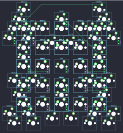

## winry/winry315

[layout](winry315-kle.json) - [PCB](winry315.kicad_pcb)

{:loading="lazy"}

[Open in keyboard-layout-editor](http://www.keyboard-layout-editor.com/##@@_d:true;&=0,0%0A%0A%0A0,0&_x:5&d:true;&=0,1%0A%0A%0A0,0;&@_x:2.75&y:-0.75&c=#777777&w:1.5&h:1.5;&=0,15%0A%0A%0A0,0;&@_x:0.75&y:-0.75;&=0,17%0A%0A%0A0,0&_x:3.5;&=0,16%0A%0A%0A0,0;&@_x:0.25&c=#aaaaaa;&=0,23%0A%0A%0A0,0&=0,22%0A%0A%0A0,0&_x:2.5;&=0,21%0A%0A%0A0,0&=0,20%0A%0A%0A0,0;&@_x:2.5&y:-0.75;&=0,19%0A%0A%0A0,0&=0,18%0A%0A%0A0,0;&@_x:1&y:0.25&c=#cccccc;&=0,0%0A%0A%0A0,0&=0,1%0A%0A%0A0,0&=0,2%0A%0A%0A0,0&=0,3%0A%0A%0A0,0&=0,4%0A%0A%0A0,0;&@_x:1;&=0,5%0A%0A%0A0,0&=0,6%0A%0A%0A0,0&=0,7%0A%0A%0A0,0&=0,8%0A%0A%0A0,0&=0,9%0A%0A%0A0,0;&@_x:1;&=0,10%0A%0A%0A0,0&=0,11%0A%0A%0A0,0&=0,12%0A%0A%0A0,0&=0,13%0A%0A%0A0,0&=0,14%0A%0A%0A0,0;&@_d:true;&=0,2%0A%0A%0A0,0&_x:5&d:true;&=0,3%0A%0A%0A0,0;&@_x:7&y:-7.0&d:true;&=0,2%0A%0A%0A0,2&_x:4&c=#777777;&=0,17%0A%0A%0A0,2&_c=#cccccc&d:true;&=0,0%0A%0A%0A0,2;&@_x:8;&=0,10%0A%0A%0A0,2&=0,5%0A%0A%0A0,2&=0,0%0A%0A%0A0,2&_x:0.5&c=#aaaaaa;&=0,23%0A%0A%0A0,2&=0,22%0A%0A%0A0,2;&@_x:8&c=#cccccc;&=0,11%0A%0A%0A0,2&=0,6%0A%0A%0A0,2&=0,1%0A%0A%0A0,2;&@_x:11.75&y:-0.75&c=#777777&w:1.5&h:1.5;&=0,15%0A%0A%0A0,2;&@_x:8&y:-0.25&c=#cccccc;&=0,12%0A%0A%0A0,2&=0,7%0A%0A%0A0,2&=0,2%0A%0A%0A0,2;&@_x:11.5&y:-0.25&c=#aaaaaa;&=0,19%0A%0A%0A0,2&=0,18%0A%0A%0A0,2;&@_x:8&y:-0.75&c=#cccccc;&=0,13%0A%0A%0A0,2&=0,8%0A%0A%0A0,2&=0,3%0A%0A%0A0,2;&@_x:8;&=0,14%0A%0A%0A0,2&=0,9%0A%0A%0A0,2&=0,4%0A%0A%0A0,2&_x:1&c=#777777;&=0,16%0A%0A%0A0,2;&@_x:7&c=#cccccc&d:true;&=0,3%0A%0A%0A0,2&_x:3.5&c=#aaaaaa;&=0,21%0A%0A%0A0,2&=0,20%0A%0A%0A0,2&_x:-0.5&c=#cccccc&d:true;&=0,1%0A%0A%0A0,2;&@_d:true;&=0,1%0A%0A%0A0,1&_c=#777777;&=0,16%0A%0A%0A0,1&_x:4&c=#cccccc&d:true;&=0,3%0A%0A%0A0,1&_d:true;&=0,3%0A%0A%0A0,3&_x:5&d:true;&=0,2%0A%0A%0A0,3;&@_x:0.5&c=#aaaaaa;&=0,21%0A%0A%0A0,1&=0,20%0A%0A%0A0,1&_x:0.5&c=#cccccc;&=0,4%0A%0A%0A0,1&=0,9%0A%0A%0A0,1&=0,14%0A%0A%0A0,1&_x:2.0;&=0,14%0A%0A%0A0,3&=0,13%0A%0A%0A0,3&=0,12%0A%0A%0A0,3&=0,11%0A%0A%0A0,3&=0,10%0A%0A%0A0,3;&@_x:3;&=0,3%0A%0A%0A0,1&=0,8%0A%0A%0A0,1&=0,13%0A%0A%0A0,1&_x:2;&=0,9%0A%0A%0A0,3&=0,8%0A%0A%0A0,3&=0,7%0A%0A%0A0,3&=0,6%0A%0A%0A0,3&=0,5%0A%0A%0A0,3;&@_x:0.75&y:-0.75&c=#777777&w:1.5&h:1.5;&=0,15%0A%0A%0A0,1;&@_x:3&y:-0.25&c=#cccccc;&=0,2%0A%0A%0A0,1&=0,7%0A%0A%0A0,1&=0,12%0A%0A%0A0,1&_x:2;&=0,4%0A%0A%0A0,3&=0,3%0A%0A%0A0,3&=0,2%0A%0A%0A0,3&=0,1%0A%0A%0A0,3&=0,0%0A%0A%0A0,3;&@_x:0.5&y:-0.25&c=#aaaaaa;&=0,19%0A%0A%0A0,1&=0,18%0A%0A%0A0,1;&@_x:3&y:-0.75&c=#cccccc;&=0,1%0A%0A%0A0,1&=0,6%0A%0A%0A0,1&=0,11%0A%0A%0A0,1;&@_x:9.75&y:-0.75&c=#777777&w:1.5&h:1.5;&=0,15%0A%0A%0A0,3;&@_x:7.75&y:-0.75;&=0,16%0A%0A%0A0,3&_x:3.5;&=0,17%0A%0A%0A0,3;&@_x:1&y:-0.5;&=0,17%0A%0A%0A0,1&_x:1&c=#cccccc;&=0,0%0A%0A%0A0,1&=0,5%0A%0A%0A0,1&=0,10%0A%0A%0A0,1;&@_x:7.25&y:-0.5&c=#aaaaaa;&=0,21%0A%0A%0A0,3&=0,20%0A%0A%0A0,3&_x:2.5;&=0,23%0A%0A%0A0,3&=0,22%0A%0A%0A0,3;&@_x:9.5&y:-0.75;&=0,19%0A%0A%0A0,3&=0,18%0A%0A%0A0,3;&@_y:-0.75&c=#cccccc&d:true;&=0,0%0A%0A%0A0,1&_x:-0.5&c=#aaaaaa;&=0,23%0A%0A%0A0,1&=0,22%0A%0A%0A0,1&_x:3.5&c=#cccccc&d:true;&=0,2%0A%0A%0A0,1&_d:true;&=0,1%0A%0A%0A0,3&_x:5.0&d:true;&=0,0%0A%0A%0A0,3)

{:loading="lazy"}

