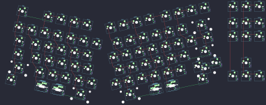

## wolf/sabre

[layout](sabre-kle.json) - [PCB](sabre.kicad_pcb)

{:loading="lazy"}

[Open in keyboard-layout-editor](http://www.keyboard-layout-editor.com/##@@_x:17&c=#aaaaaa;&=1,7&=0,8&=1,8;&@_x:17&y:0.25;&=3,7&=2,8&=3,8;&@_x:17;&=5,7&=4,8&=5,8;&@_x:18&y:1.0;&=8,8;&@_x:17;&=11,7&=10,8&=11,8;&@_r:12&x:1.25&y:-6.25&c=#777777;&=0,0&_x:1.0&c=#cccccc;&=0,1&=1,1&=0,2&=1,2;&@_x:1.25&y:0.25&c=#aaaaaa;&=2,0&_c=#cccccc;&=3,0&=2,1&=3,1&=2,2&=3,2&=2,3;&@_x:1.25&c=#aaaaaa&w:1.5;&=4,0&_c=#cccccc;&=5,0&=4,1&=5,1&=4,2&=5,2;&@_x:1.25&c=#aaaaaa&w:1.75;&=6,0&_c=#cccccc;&=7,0&=6,1&=7,1&=6,2&=7,2;&@_x:1.25&c=#aaaaaa&w:2.25;&=8,0&_c=#cccccc;&=9,0&=8,1&=9,1&=8,2&=9,2;&@_x:1.25&c=#aaaaaa&w:1.5;&=10,0&_x:1.0&w:1.5;&=11,0%0A%0A%0A0,0&=10,1%0A%0A%0A0,0&_c=#777777&w:2.25;&=10,2;&@_r:-12&rx:15.75&x:-8.25&c=#cccccc;&=1,3&=0,4&=1,4&=0,5&_x:0.25;&=1,5&=0,6&=1,6&=0,7;&@_x:-8.0&y:0.25;&=3,3&=2,4&=3,4&=2,5&=3,5&=2,6&_w:2;&=3,6;&@_x:-8.5;&=4,3&=5,3&=4,4&=5,4&=4,5&=5,5&=4,6&_w:1.5;&=5,6;&@_x:-8.25;&=6,3&=7,3&=6,4&=7,4&=6,5&=7,5&_c=#777777&w:2.25;&=7,6;&@_x:-8.75&c=#cccccc;&=8,3&=9,3&=8,4&=9,4&=8,5&=9,5&_c=#aaaaaa&w:1.75;&=8,6%0A%0A%0A2,0&=9,6%0A%0A%0A2,0;&@_x:-8.75&c=#777777&w:2.75;&=11,3&_c=#aaaaaa;&=11,4%0A%0A%0A1,0&_w:1.5;&=10,5%0A%0A%0A1,0&_x:1.0&w:1.5;&=10,6;&@_r:12&rx:0&x:3.75&y:6.5;&=11,0%0A%0A%0A0,1&_w:1.5;&=10,1%0A%0A%0A0,1;&@_x:3.75&w:1.25;&=11,0%0A%0A%0A0,2&_w:1.25;&=10,1%0A%0A%0A0,2;&@_r:-12&rx:15.75&x:-6.0&y:6.5&w:1.5;&=11,4%0A%0A%0A1,1&=10,5%0A%0A%0A1,1;&@_x:-6.0&w:1.25;&=11,4%0A%0A%0A1,2&_w:1.25;&=10,5%0A%0A%0A1,2;&@_rx:17&x:-4&y:6.25&w:2.75;&=9,6%0A%0A%0A2,1)

{:loading="lazy"}

