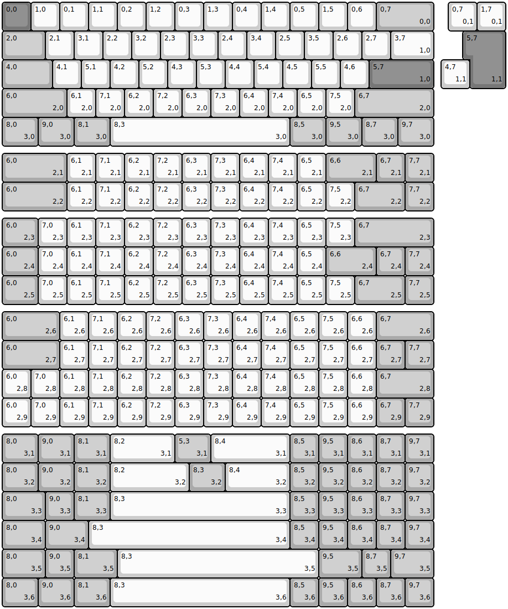
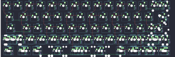

## wolf/ts60

[layout](ts60-kle.json) - [PCB](ts60.kicad_pcb)

{:loading="lazy"}

[Open in keyboard-layout-editor](http://www.keyboard-layout-editor.com/##@@_c=#777777;&=0,0&_c=#cccccc;&=1,0&=0,1&=1,1&=0,2&=1,2&=0,3&=1,3&=0,4&=1,4&=0,5&=1,5&=0,6&_c=#aaaaaa&w:2;&=0,7%0A%0A%0A0,0;&@_w:1.5;&=2,0&_c=#cccccc;&=2,1&=3,1&=2,2&=3,2&=2,3&=3,3&=2,4&=3,4&=2,5&=3,5&=2,6&=2,7&_w:1.5;&=3,7%0A%0A%0A1,0;&@_c=#aaaaaa&w:1.75;&=4,0&_c=#cccccc;&=4,1&=5,1&=4,2&=5,2&=4,3&=5,3&=4,4&=5,4&=4,5&=5,5&=4,6&_c=#777777&w:2.25;&=5,7%0A%0A%0A1,0;&@_c=#aaaaaa&w:2.25;&=6,0%0A%0A%0A2,0&_c=#cccccc;&=6,1%0A%0A%0A2,0&=7,1%0A%0A%0A2,0&=6,2%0A%0A%0A2,0&=7,2%0A%0A%0A2,0&=6,3%0A%0A%0A2,0&=7,3%0A%0A%0A2,0&=6,4%0A%0A%0A2,0&=7,4%0A%0A%0A2,0&=6,5%0A%0A%0A2,0&=7,5%0A%0A%0A2,0&_d:true;&=6,6%0A%0A%0A2,0&_x:-1.0&c=#aaaaaa&w:2.75;&=6,7%0A%0A%0A2,0;&@_w:1.25;&=8,0%0A%0A%0A3,0&_w:1.25;&=9,0%0A%0A%0A3,0&_w:1.25;&=8,1%0A%0A%0A3,0&_c=#cccccc&w:6.25;&=8,3%0A%0A%0A3,0&_c=#aaaaaa&w:1.25;&=8,5%0A%0A%0A3,0&_w:1.25;&=9,5%0A%0A%0A3,0&_w:1.25;&=8,7%0A%0A%0A3,0&_w:1.25;&=9,7%0A%0A%0A3,0;&@_x:15.5&y:-5&c=#cccccc;&=0,7%0A%0A%0A0,1&=1,7%0A%0A%0A0,1;&@_x:16.25&c=#777777&w:1.25&h:2&w2:1.5&h2:1&x2:-0.25;&=5,7%0A%0A%0A1,1;&@_x:15.25&c=#cccccc;&=4,7%0A%0A%0A1,1;&@_y:2.25&c=#aaaaaa&w:2.25;&=6,0%0A%0A%0A2,1&_c=#cccccc;&=6,1%0A%0A%0A2,1&=7,1%0A%0A%0A2,1&=6,2%0A%0A%0A2,1&=7,2%0A%0A%0A2,1&=6,3%0A%0A%0A2,1&=7,3%0A%0A%0A2,1&=6,4%0A%0A%0A2,1&=7,4%0A%0A%0A2,1&=6,5%0A%0A%0A2,1&_c=#aaaaaa&w:1.75;&=6,6%0A%0A%0A2,1&=6,7%0A%0A%0A2,1&=7,7%0A%0A%0A2,1;&@_w:2.25;&=6,0%0A%0A%0A2,2&_c=#cccccc;&=6,1%0A%0A%0A2,2&=7,1%0A%0A%0A2,2&=6,2%0A%0A%0A2,2&=7,2%0A%0A%0A2,2&=6,3%0A%0A%0A2,2&=7,3%0A%0A%0A2,2&=6,4%0A%0A%0A2,2&=7,4%0A%0A%0A2,2&=6,5%0A%0A%0A2,2&=7,5%0A%0A%0A2,2&_c=#aaaaaa&w:1.75;&=6,7%0A%0A%0A2,2&=7,7%0A%0A%0A2,2;&@_y:0.25&w:1.25;&=6,0%0A%0A%0A2,3&_c=#cccccc;&=7,0%0A%0A%0A2,3&=6,1%0A%0A%0A2,3&=7,1%0A%0A%0A2,3&=6,2%0A%0A%0A2,3&=7,2%0A%0A%0A2,3&=6,3%0A%0A%0A2,3&=7,3%0A%0A%0A2,3&=6,4%0A%0A%0A2,3&=7,4%0A%0A%0A2,3&=6,5%0A%0A%0A2,3&=7,5%0A%0A%0A2,3&_c=#aaaaaa&w:2.75;&=6,7%0A%0A%0A2,3;&@_w:1.25;&=6,0%0A%0A%0A2,4&_c=#cccccc;&=7,0%0A%0A%0A2,4&=6,1%0A%0A%0A2,4&=7,1%0A%0A%0A2,4&=6,2%0A%0A%0A2,4&=7,2%0A%0A%0A2,4&=6,3%0A%0A%0A2,4&=7,3%0A%0A%0A2,4&=6,4%0A%0A%0A2,4&=7,4%0A%0A%0A2,4&=6,5%0A%0A%0A2,4&_c=#aaaaaa&w:1.75;&=6,6%0A%0A%0A2,4&=6,7%0A%0A%0A2,4&=7,7%0A%0A%0A2,4;&@_w:1.25;&=6,0%0A%0A%0A2,5&_c=#cccccc;&=7,0%0A%0A%0A2,5&=6,1%0A%0A%0A2,5&=7,1%0A%0A%0A2,5&=6,2%0A%0A%0A2,5&=7,2%0A%0A%0A2,5&=6,3%0A%0A%0A2,5&=7,3%0A%0A%0A2,5&=6,4%0A%0A%0A2,5&=7,4%0A%0A%0A2,5&=6,5%0A%0A%0A2,5&=7,5%0A%0A%0A2,5&_c=#aaaaaa&w:1.75;&=6,7%0A%0A%0A2,5&=7,7%0A%0A%0A2,5;&@_y:0.25&w:2;&=6,0%0A%0A%0A2,6&_c=#cccccc;&=6,1%0A%0A%0A2,6&=7,1%0A%0A%0A2,6&=6,2%0A%0A%0A2,6&=7,2%0A%0A%0A2,6&=6,3%0A%0A%0A2,6&=7,3%0A%0A%0A2,6&=6,4%0A%0A%0A2,6&=7,4%0A%0A%0A2,6&=6,5%0A%0A%0A2,6&=7,5%0A%0A%0A2,6&=6,6%0A%0A%0A2,6&_c=#aaaaaa&w:2;&=6,7%0A%0A%0A2,6;&@_w:2;&=6,0%0A%0A%0A2,7&_c=#cccccc;&=6,1%0A%0A%0A2,7&=7,1%0A%0A%0A2,7&=6,2%0A%0A%0A2,7&=7,2%0A%0A%0A2,7&=6,3%0A%0A%0A2,7&=7,3%0A%0A%0A2,7&=6,4%0A%0A%0A2,7&=7,4%0A%0A%0A2,7&=6,5%0A%0A%0A2,7&=7,5%0A%0A%0A2,7&=6,6%0A%0A%0A2,7&_c=#aaaaaa;&=6,7%0A%0A%0A2,7&=7,7%0A%0A%0A2,7;&@_c=#cccccc;&=6,0%0A%0A%0A2,8&=7,0%0A%0A%0A2,8&=6,1%0A%0A%0A2,8&=7,1%0A%0A%0A2,8&=6,2%0A%0A%0A2,8&=7,2%0A%0A%0A2,8&=6,3%0A%0A%0A2,8&=7,3%0A%0A%0A2,8&=6,4%0A%0A%0A2,8&=7,4%0A%0A%0A2,8&=6,5%0A%0A%0A2,8&=7,5%0A%0A%0A2,8&=6,6%0A%0A%0A2,8&_c=#aaaaaa&w:2;&=6,7%0A%0A%0A2,8;&@_c=#cccccc;&=6,0%0A%0A%0A2,9&=7,0%0A%0A%0A2,9&=6,1%0A%0A%0A2,9&=7,1%0A%0A%0A2,9&=6,2%0A%0A%0A2,9&=7,2%0A%0A%0A2,9&=6,3%0A%0A%0A2,9&=7,3%0A%0A%0A2,9&=6,4%0A%0A%0A2,9&=7,4%0A%0A%0A2,9&=6,5%0A%0A%0A2,9&=7,5%0A%0A%0A2,9&=6,6%0A%0A%0A2,9&_c=#aaaaaa;&=6,7%0A%0A%0A2,9&=7,7%0A%0A%0A2,9;&@_y:0.25&w:1.25;&=8,0%0A%0A%0A3,1&_w:1.25;&=9,0%0A%0A%0A3,1&_w:1.25;&=8,1%0A%0A%0A3,1&_c=#cccccc&w:2.25;&=8,2%0A%0A%0A3,1&_c=#aaaaaa&w:1.25;&=5,3%0A%0A%0A3,1&_c=#cccccc&w:2.75;&=8,4%0A%0A%0A3,1&_c=#aaaaaa;&=8,5%0A%0A%0A3,1&=9,5%0A%0A%0A3,1&=8,6%0A%0A%0A3,1&=8,7%0A%0A%0A3,1&=9,7%0A%0A%0A3,1;&@_w:1.25;&=8,0%0A%0A%0A3,2&_w:1.25;&=9,0%0A%0A%0A3,2&_w:1.25;&=8,1%0A%0A%0A3,2&_c=#cccccc&w:2.75;&=8,2%0A%0A%0A3,2&_c=#aaaaaa&w:1.25;&=8,3%0A%0A%0A3,2&_c=#cccccc&w:2.25;&=8,4%0A%0A%0A3,2&_c=#aaaaaa;&=8,5%0A%0A%0A3,2&=9,5%0A%0A%0A3,2&=8,6%0A%0A%0A3,2&=8,7%0A%0A%0A3,2&=9,7%0A%0A%0A3,2;&@_w:1.5;&=8,0%0A%0A%0A3,3&=9,0%0A%0A%0A3,3&_w:1.25;&=8,1%0A%0A%0A3,3&_c=#cccccc&w:6.25;&=8,3%0A%0A%0A3,3&_c=#aaaaaa;&=8,5%0A%0A%0A3,3&=9,5%0A%0A%0A3,3&=8,6%0A%0A%0A3,3&=8,7%0A%0A%0A3,3&=9,7%0A%0A%0A3,3;&@_w:1.5;&=8,0%0A%0A%0A3,4&_w:1.5;&=9,0%0A%0A%0A3,4&_c=#cccccc&w:7;&=8,3%0A%0A%0A3,4&_c=#aaaaaa;&=8,5%0A%0A%0A3,4&=9,5%0A%0A%0A3,4&=8,6%0A%0A%0A3,4&=8,7%0A%0A%0A3,4&=9,7%0A%0A%0A3,4;&@_w:1.5;&=8,0%0A%0A%0A3,5&=9,0%0A%0A%0A3,5&_w:1.5;&=8,1%0A%0A%0A3,5&_c=#cccccc&w:7;&=8,3%0A%0A%0A3,5&_c=#aaaaaa&w:1.5;&=9,5%0A%0A%0A3,5&=8,7%0A%0A%0A3,5&_w:1.5;&=9,7%0A%0A%0A3,5;&@_w:1.25;&=8,0%0A%0A%0A3,6&_w:1.25;&=9,0%0A%0A%0A3,6&_w:1.25;&=8,1%0A%0A%0A3,6&_c=#cccccc&w:6.25;&=8,3%0A%0A%0A3,6&_c=#aaaaaa;&=8,5%0A%0A%0A3,6&=9,5%0A%0A%0A3,6&=8,6%0A%0A%0A3,6&=8,7%0A%0A%0A3,6&=9,7%0A%0A%0A3,6)

{:loading="lazy"}

