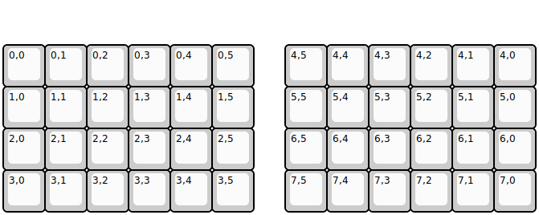
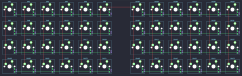

## wootpatoot/lets_split/lets_split_v2

[layout](lets_split_v2-kle.json) - [PCB](lets_split_v2.kicad_pcb)

{:loading="lazy"}

[Open in keyboard-layout-editor](http://www.keyboard-layout-editor.com/##@@_y:1;&=0,0&=0,1&=0,2&=0,3&=0,4&=0,5&_x:0.75;&=4,5&=4,4&=4,3&=4,2&=4,1&=4,0;&@=1,0&=1,1&=1,2&=1,3&=1,4&=1,5&_x:0.75;&=5,5&=5,4&=5,3&=5,2&=5,1&=5,0;&@=2,0&=2,1&=2,2&=2,3&=2,4&=2,5&_x:0.75;&=6,5&=6,4&=6,3&=6,2&=6,1&=6,0;&@=3,0&=3,1&=3,2&=3,3&=3,4&=3,5&_x:0.75;&=7,5&=7,4&=7,3&=7,2&=7,1&=7,0)

{:loading="lazy"}

