## work_louder/loop

[layout](loop-kle.json) - [PCB](loop.kicad_pcb)

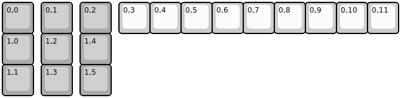{:loading="lazy"}

[Open in keyboard-layout-editor](http://www.keyboard-layout-editor.com/##@@_c=#aaaaaa;&=0,0&_x:0.25;&=0,1&_x:0.25;&=0,2&_x:0.25&c=#ccccccc;&=0,3&=0,4&=0,5&=0,6&=0,7&=0,8&=0,9&=0,10&=0,11;&@_c=#aaaaaa;&=1,0&_x:0.25;&=1,2&_x:0.25;&=1,4;&@=1,1&_x:0.25;&=1,3&_x:0.25;&=1,5)

{:loading="lazy"}

## work_louder/loop_e

[layout](loop_e-kle.json) - [PCB](loop_e.kicad_pcb)

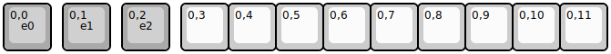{:loading="lazy"}

[Open in keyboard-layout-editor](http://www.keyboard-layout-editor.com/##@@_c=#aaaaaa;&=0,0%0A%0A%0A%0A%0A%0A%0A%0A%0Ae0&_x:0.25;&=0,1%0A%0A%0A%0A%0A%0A%0A%0A%0Ae1&_x:0.25;&=0,2%0A%0A%0A%0A%0A%0A%0A%0A%0Ae2&_x:0.25&c=#ccccccc;&=0,3&=0,4&=0,5&=0,6&=0,7&=0,8&=0,9&=0,10&=0,11)

{:loading="lazy"}

## work_louder/micro

[layout](micro-kle.json) - [PCB](micro.kicad_pcb)

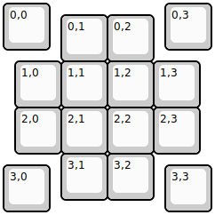{:loading="lazy"}

[Open in keyboard-layout-editor](http://www.keyboard-layout-editor.com/##@@=0,0%0A%0A%0A%0A%0A%0A%0A%0A%0Ae0&_x:2.5;&=0,3%0A%0A%0A%0A%0A%0A%0A%0A%0Ae1;&@_x:1.25&y:-0.75;&=0,1&=0,2;&@_x:0.25;&=1,0&=1,1&=1,2&=1,3;&@_x:0.25;&=2,0&=2,1&=2,2&=2,3;&@_x:1.25;&=3,1&=3,2;&@_y:-0.75;&=3,0&_x:2.5;&=3,3)

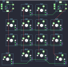{:loading="lazy"}

## work_louder/nano

[layout](nano-kle.json) - [PCB](nano.kicad_pcb)

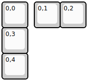{:loading="lazy"}

[Open in keyboard-layout-editor](http://www.keyboard-layout-editor.com/##@@=0,0&_x:0.25;&=0,1&=0,2;&@=0,3;&@=0,4)

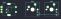{:loading="lazy"}

## work_louder/nano_e

[layout](nano_e-kle.json) - [PCB](nano_e.kicad_pcb)

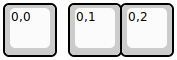{:loading="lazy"}

[Open in keyboard-layout-editor](http://www.keyboard-layout-editor.com/##@@=0,0%0A%0A%0A%0A%0A%0A%0A%0A%0Ae0&_x:0.25;&=0,1&=0,2)

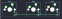{:loading="lazy"}

## work_louder/work_board

[layout](work_board-kle.json) - [PCB](work_board.kicad_pcb)

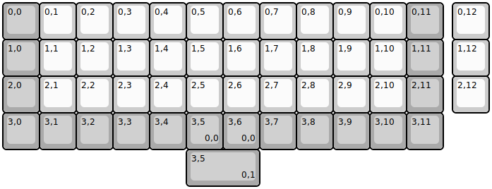{:loading="lazy"}

[Open in keyboard-layout-editor](http://www.keyboard-layout-editor.com/##@@_c=#aaaaaa;&=0,0&_c=#ccccccc;&=0,1&=0,2&=0,3&=0,4&=0,5&=0,6&=0,7&=0,8&=0,9&=0,10&_c=#aaaaaa;&=0,11&_x:0.25&c=#ccccccc;&=0,12;&@_c=#aaaaaa;&=1,0&_c=#ccccccc;&=1,1&=1,2&=1,3&=1,4&=1,5&=1,6&=1,7&=1,8&=1,9&=1,10&_c=#aaaaaa;&=1,11&_x:0.25&c=#ccccccc;&=1,12;&@_c=#aaaaaa;&=2,0&_c=#ccccccc;&=2,1&=2,2&=2,3&=2,4&=2,5&=2,6&=2,7&=2,8&=2,9&=2,10&_c=#aaaaaa;&=2,11&_x:0.25&c=#ccccccc;&=2,12;&@_c=#aaaaaa;&=3,0&=3,1&=3,2&=3,3&=3,4&=3,5%0A%0A%0A0,0&=3,6%0A%0A%0A0,0&=3,7&=3,8&=3,9&=3,10&=3,11;&@_x:5&w:2;&=3,5%0A%0A%0A0,1)

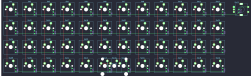{:loading="lazy"}

## work_louder/work_board_e

[layout](work_board_e-kle.json) - [PCB](work_board_e.kicad_pcb)

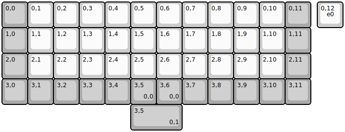{:loading="lazy"}

[Open in keyboard-layout-editor](http://www.keyboard-layout-editor.com/##@@_c=#aaaaaa;&=0,0&_c=#ccccccc;&=0,1&=0,2&=0,3&=0,4&=0,5&=0,6&=0,7&=0,8&=0,9&=0,10&_c=#aaaaaa;&=0,11&_x:0.25&c=#ccccccc;&=0,12%0A%0A%0A%0A%0A%0A%0A%0A%0Ae0;&@_c=#aaaaaa;&=1,0&_c=#ccccccc;&=1,1&=1,2&=1,3&=1,4&=1,5&=1,6&=1,7&=1,8&=1,9&=1,10&_c=#aaaaaa;&=1,11;&@=2,0&_c=#ccccccc;&=2,1&=2,2&=2,3&=2,4&=2,5&=2,6&=2,7&=2,8&=2,9&=2,10&_c=#aaaaaa;&=2,11;&@=3,0&=3,1&=3,2&=3,3&=3,4&=3,5%0A%0A%0A0,0&=3,6%0A%0A%0A0,0&=3,7&=3,8&=3,9&=3,10&=3,11;&@_x:5&w:2;&=3,5%0A%0A%0A0,1)

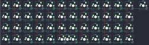{:loading="lazy"}

