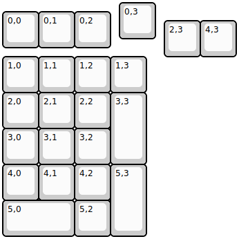
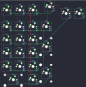

## wuque/mammoth20x

[layout](mammoth20x-kle.json) - [PCB](mammoth20x.kicad_pcb)

{:loading="lazy"}

[Open in keyboard-layout-editor](http://www.keyboard-layout-editor.com/##@@_x:3.25;&=0,3;&@_y:-0.75;&=0,0&=0,1&=0,2;&@_x:4.5&y:-0.75;&=2,3&=4,3;&@=1,0&=1,1&=1,2&=1,3;&@=2,0&=2,1&=2,2&_h:2;&=3,3;&@=3,0&=3,1&=3,2;&@=4,0&=4,1&=4,2&_h:2;&=5,3;&@_w:2;&=5,0&=5,2)

{:loading="lazy"}

