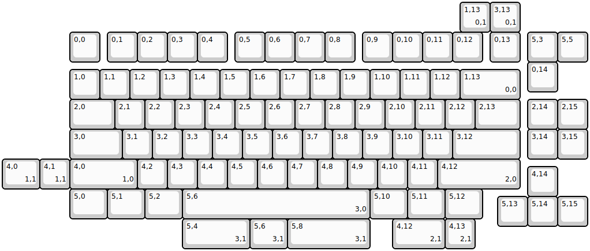
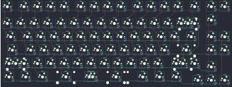

## wuque/mammoth75x

[layout](mammoth75x-kle.json) - [PCB](mammoth75x.kicad_pcb)

{:loading="lazy"}

[Open in keyboard-layout-editor](http://www.keyboard-layout-editor.com/##@@_x:2.25&y:1;&=0,0&_x:0.25;&=0,1&=0,2&=0,3&=0,4&_x:0.25;&=0,5&=0,6&=0,7&=0,8&_x:0.25;&=0,9&=0,10&=0,11&=0,12&_x:0.25;&=0,13&_x:0.25;&=5,3&=5,5;&@_x:17.5;&=0,14;&@_x:2.25&y:-0.75;&=1,0&=1,1&=1,2&=1,3&=1,4&=1,5&=1,6&=1,7&=1,8&=1,9&=1,10&=1,11&=1,12&_w:2;&=1,13%0A%0A%0A0,0;&@_x:2.25&w:1.5;&=2,0&=2,1&=2,2&=2,3&=2,4&=2,5&=2,6&=2,7&=2,8&=2,9&=2,10&=2,11&=2,12&_w:1.5;&=2,13&_x:0.25;&=2,14&=2,15;&@_x:2.25&w:1.75;&=3,0&=3,1&=3,2&=3,3&=3,4&=3,5&=3,6&=3,7&=3,8&=3,9&=3,10&=3,11&_w:2.25;&=3,12&_x:0.25;&=3,14&=3,15;&@_x:2.25&w:2.25;&=4,0%0A%0A%0A1,0&=4,2&=4,3&=4,4&=4,5&=4,6&=4,7&=4,8&=4,9&=4,10&=4,11&_w:2.75;&=4,12%0A%0A%0A2,0;&@_x:17.5&y:-0.75;&=4,14;&@_x:2.25&y:-0.25&w:1.25;&=5,0&_w:1.25;&=5,1&_w:1.25;&=5,2&_w:6.25;&=5,6%0A%0A%0A3,0&_w:1.25;&=5,10&_w:1.25;&=5,11&_w:1.25;&=5,12;&@_x:16.5&y:-0.75;&=5,13&=5,14&=5,15;&@_x:15.25&y:-7.5;&=1,13%0A%0A%0A0,1&=3,13%0A%0A%0A0,1;&@_y:4.25&w:1.25;&=4,0%0A%0A%0A1,1&=4,1%0A%0A%0A1,1;&@_x:6&y:1.0&w:2.25;&=5,4%0A%0A%0A3,1&_w:1.25;&=5,6%0A%0A%0A3,1&_w:2.75;&=5,8%0A%0A%0A3,1&_x:0.75&w:1.75;&=4,12%0A%0A%0A2,1&=4,13%0A%0A%0A2,1)

{:loading="lazy"}

