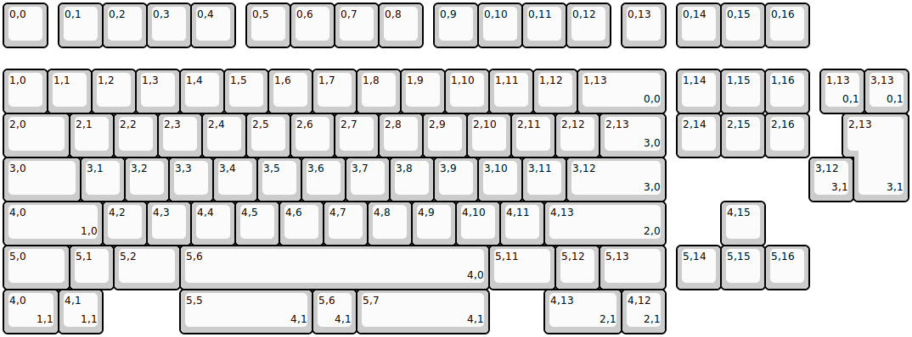
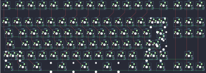
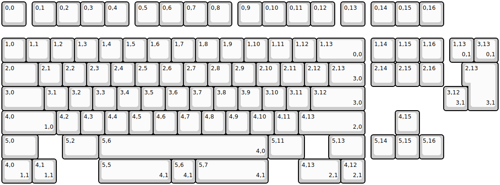
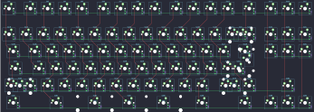

## wuque/promise87/promise87_ansi

[layout](promise87_ansi-kle.json) - [PCB](promise87_ansi.kicad_pcb)

{:loading="lazy"}

[Open in keyboard-layout-editor](http://www.keyboard-layout-editor.com/##@@=0,0&_x:0.25;&=0,1&=0,2&=0,3&=0,4&_x:0.25;&=0,5&=0,6&=0,7&=0,8&_x:0.25;&=0,9&=0,10&=0,11&=0,12&_x:0.25;&=0,13&_x:0.25;&=0,14&=0,15&=0,16;&@_y:0.5;&=1,0&=1,1&=1,2&=1,3&=1,4&=1,5&=1,6&=1,7&=1,8&=1,9&=1,10&=1,11&=1,12&_w:2;&=1,13%0A%0A%0A0,0&_x:0.25;&=1,14&=1,15&=1,16;&@_w:1.5;&=2,0&=2,1&=2,2&=2,3&=2,4&=2,5&=2,6&=2,7&=2,8&=2,9&=2,10&=2,11&=2,12&_w:1.5;&=2,13%0A%0A%0A3,0&_x:0.25;&=2,14&=2,15&=2,16;&@_w:1.75;&=3,0&=3,1&=3,2&=3,3&=3,4&=3,5&=3,6&=3,7&=3,8&=3,9&=3,10&=3,11&_w:2.25;&=3,12%0A%0A%0A3,0;&@_w:2.25;&=4,0%0A%0A%0A1,0&=4,2&=4,3&=4,4&=4,5&=4,6&=4,7&=4,8&=4,9&=4,10&=4,11&_w:2.75;&=4,13%0A%0A%0A2,0&_x:1.25;&=4,15;&@_w:1.5;&=5,0&=5,1&_w:1.5;&=5,2&_w:7;&=5,6%0A%0A%0A4,0&_w:1.5;&=5,11&=5,12&_w:1.5;&=5,13&_x:0.25;&=5,14&=5,15&=5,16;&@_x:18.5&y:-5.0;&=1,13%0A%0A%0A0,1&=3,13%0A%0A%0A0,1;&@_x:19.25&w:1.25&h:2&w2:1.5&h2:1&x2:-0.25;&=2,13%0A%0A%0A3,1;&@_x:18.25;&=3,12%0A%0A%0A3,1;&@_y:2.0&w:1.25;&=4,0%0A%0A%0A1,1&=4,1%0A%0A%0A1,1&_x:1.75&w:3;&=5,5%0A%0A%0A4,1&=5,6%0A%0A%0A4,1&_w:3;&=5,7%0A%0A%0A4,1&_x:1.25&w:1.75;&=4,13%0A%0A%0A2,1&=4,12%0A%0A%0A2,1)

{:loading="lazy"}

## wuque/promise87/promise87_wkl

[layout](promise87_wkl-kle.json) - [PCB](promise87_wkl.kicad_pcb)

{:loading="lazy"}

[Open in keyboard-layout-editor](http://www.keyboard-layout-editor.com/##@@=0,0&_x:0.25;&=0,1&=0,2&=0,3&=0,4&_x:0.25;&=0,5&=0,6&=0,7&=0,8&_x:0.25;&=0,9&=0,10&=0,11&=0,12&_x:0.25;&=0,13&_x:0.25;&=0,14&=0,15&=0,16;&@_y:0.5;&=1,0&=1,1&=1,2&=1,3&=1,4&=1,5&=1,6&=1,7&=1,8&=1,9&=1,10&=1,11&=1,12&_w:2;&=1,13%0A%0A%0A0,0&_x:0.25;&=1,14&=1,15&=1,16;&@_w:1.5;&=2,0&=2,1&=2,2&=2,3&=2,4&=2,5&=2,6&=2,7&=2,8&=2,9&=2,10&=2,11&=2,12&_w:1.5;&=2,13%0A%0A%0A3,0&_x:0.25;&=2,14&=2,15&=2,16;&@_w:1.75;&=3,0&=3,1&=3,2&=3,3&=3,4&=3,5&=3,6&=3,7&=3,8&=3,9&=3,10&=3,11&_w:2.25;&=3,12%0A%0A%0A3,0;&@_w:2.25;&=4,0%0A%0A%0A1,0&=4,2&=4,3&=4,4&=4,5&=4,6&=4,7&=4,8&=4,9&=4,10&=4,11&_w:2.75;&=4,13%0A%0A%0A2,0&_x:1.25;&=4,15;&@_w:1.5;&=5,0&_x:1.0&w:1.5;&=5,2&_w:7;&=5,6%0A%0A%0A4,0&_w:1.5;&=5,11&_x:1.0&w:1.5;&=5,13&_x:0.25;&=5,14&=5,15&=5,16;&@_x:18.5&y:-5.0;&=1,13%0A%0A%0A0,1&=3,13%0A%0A%0A0,1;&@_x:19.25&w:1.25&h:2&w2:1.5&h2:1&x2:-0.25;&=2,13%0A%0A%0A3,1;&@_x:18.25;&=3,12%0A%0A%0A3,1;&@_y:2.0&w:1.25;&=4,0%0A%0A%0A1,1&=4,1%0A%0A%0A1,1&_x:1.75&w:3;&=5,5%0A%0A%0A4,1&=5,6%0A%0A%0A4,1&_w:3;&=5,7%0A%0A%0A4,1&_x:1.25&w:1.75;&=4,13%0A%0A%0A2,1&=4,12%0A%0A%0A2,1)

{:loading="lazy"}

