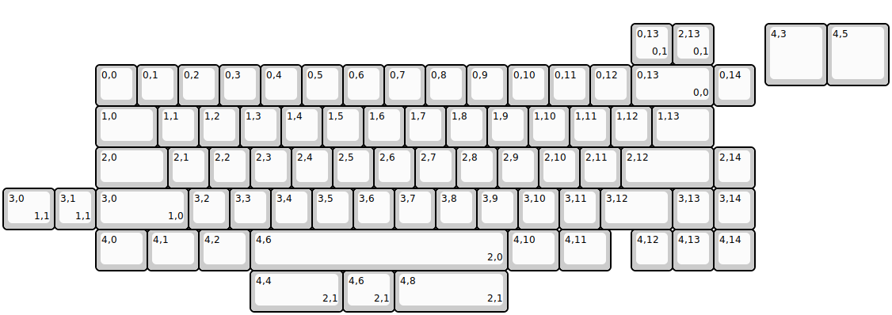
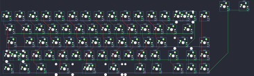

## wuque/serneity65

[layout](serneity65-kle.json) - [PCB](serneity65.kicad_pcb)

{:loading="lazy"}

[Open in keyboard-layout-editor](http://www.keyboard-layout-editor.com/##@@_x:18.5&y:0.5&w:1.5&h:1.5;&=4,3&_w:1.5&h:1.5;&=4,5;&@_x:2.25;&=0,0&=0,1&=0,2&=0,3&=0,4&=0,5&=0,6&=0,7&=0,8&=0,9&=0,10&=0,11&=0,12&_w:2;&=0,13%0A%0A%0A0,0&=0,14;&@_x:2.25&w:1.5;&=1,0&=1,1&=1,2&=1,3&=1,4&=1,5&=1,6&=1,7&=1,8&=1,9&=1,10&=1,11&=1,12&_w:1.5;&=1,13;&@_x:2.25&w:1.75;&=2,0&=2,1&=2,2&=2,3&=2,4&=2,5&=2,6&=2,7&=2,8&=2,9&=2,10&=2,11&_w:2.25;&=2,12&=2,14;&@_x:2.25&w:2.25;&=3,0%0A%0A%0A1,0&=3,2&=3,3&=3,4&=3,5&=3,6&=3,7&=3,8&=3,9&=3,10&=3,11&_w:1.75;&=3,12&=3,13&=3,14;&@_x:2.25&w:1.25;&=4,0&_w:1.25;&=4,1&_w:1.25;&=4,2&_w:6.25;&=4,6%0A%0A%0A2,0&_w:1.25;&=4,10&_w:1.25;&=4,11&_x:0.5;&=4,12&=4,13&=4,14;&@_x:15.25&y:-6.0;&=0,13%0A%0A%0A0,1&=2,13%0A%0A%0A0,1;&@_y:3.0&w:1.25;&=3,0%0A%0A%0A1,1&=3,1%0A%0A%0A1,1;&@_x:6&y:1.0&w:2.25;&=4,4%0A%0A%0A2,1&_w:1.25;&=4,6%0A%0A%0A2,1&_w:2.75;&=4,8%0A%0A%0A2,1)

{:loading="lazy"}

