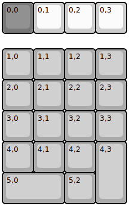
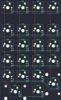

## xbows/numpad

[layout](numpad-kle.json) - [PCB](numpad.kicad_pcb)

{:loading="lazy"}

[Open in keyboard-layout-editor](http://www.keyboard-layout-editor.com/##@@_c=#777777;&=0,0&_c=#cccccc;&=0,1&=0,2&=0,3;&@_y:0.5&c=#aaaaaa;&=1,0&=1,1&=1,2&=1,3;&@=2,0&=2,1&=2,2&=2,3;&@=3,0&=3,1&=3,2&=3,3;&@=4,0&=4,1&=4,2&_h:2;&=4,3;&@_w:2;&=5,0&=5,2)

{:loading="lazy"}

