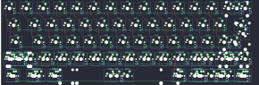
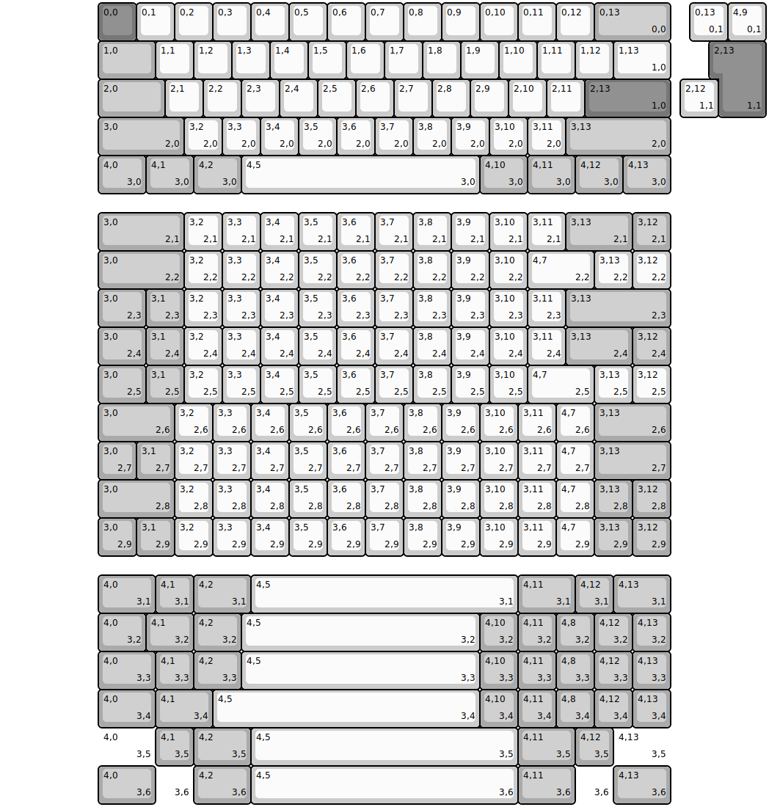
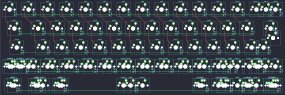
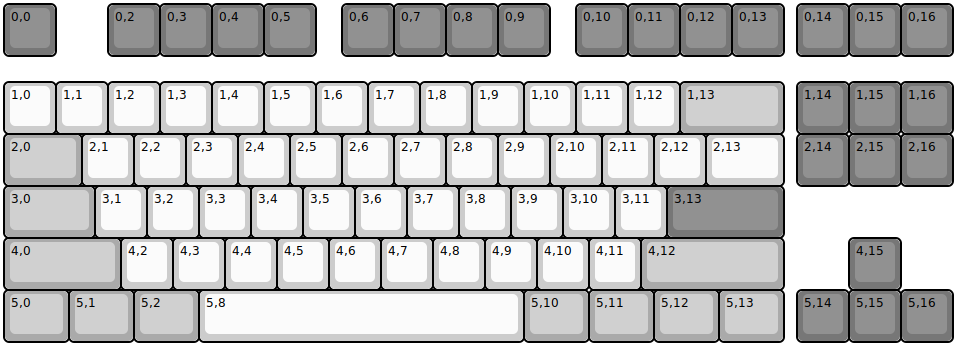
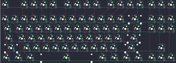
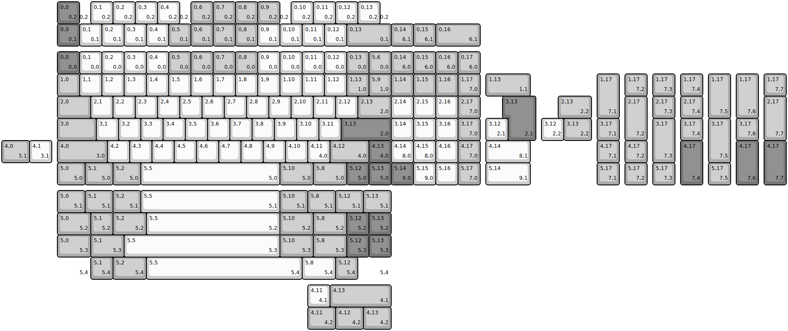
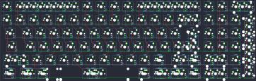

## xd/xd60rev2

[layout](xd60rev2-kle.json) - [PCB](xd60rev2.kicad_pcb)

{:loading="lazy"}

[Open in keyboard-layout-editor](http://www.keyboard-layout-editor.com/##@@_x:2.5&c=#777777;&=0,0&_c=#cccccc;&=0,1&=0,2&=0,3&=0,4&=0,5&=0,6&=0,7&=0,8&=0,9&=0,10&=0,11&=0,12&_c=#aaaaaa&w:2;&=0,13%0A%0A%0A0,0;&@_x:2.5&w:1.5;&=1,0&_c=#cccccc;&=1,1&=1,2&=1,3&=1,4&=1,5&=1,6&=1,7&=1,8&=1,9&=1,10&=1,11&=1,12&_w:1.5;&=1,13%0A%0A%0A1,0;&@_x:2.5&c=#aaaaaa&w:1.75;&=2,0&_c=#cccccc;&=2,1&=2,2&=2,3&=2,4&=2,5&=2,6&=2,7&=2,8&=2,9&=2,10&=2,11&_c=#777777&w:2.25;&=2,13%0A%0A%0A1,0;&@_x:2.5&c=#aaaaaa&w:2.25;&=3,0%0A%0A%0A2,0&_c=#cccccc;&=3,2%0A%0A%0A2,0&=3,3%0A%0A%0A2,0&=3,4%0A%0A%0A2,0&=3,5%0A%0A%0A2,0&=3,6%0A%0A%0A2,0&=3,7%0A%0A%0A2,0&=3,8%0A%0A%0A2,0&=3,9%0A%0A%0A2,0&=3,10%0A%0A%0A2,0&=3,11%0A%0A%0A2,0&_c=#aaaaaa&w:2.75;&=3,13%0A%0A%0A2,0;&@_x:2.5&w:1.25;&=4,0%0A%0A%0A3,0&_w:1.25;&=4,1%0A%0A%0A3,0&_w:1.25;&=4,2%0A%0A%0A3,0&_c=#cccccc&w:6.25;&=4,5%0A%0A%0A3,0&_c=#aaaaaa&w:1.25;&=4,10%0A%0A%0A3,0&_w:1.25;&=4,11%0A%0A%0A3,0&_w:1.25;&=4,12%0A%0A%0A3,0&_w:1.25;&=4,13%0A%0A%0A3,0;&@_x:18.0&y:-5&c=#cccccc;&=0,13%0A%0A%0A0,1&=4,9%0A%0A%0A0,1;&@_x:18.75&c=#777777&w:1.25&h:2&w2:1.5&h2:1&x2:-0.25;&=2,13%0A%0A%0A1,1;&@_x:17.75&c=#cccccc;&=2,12%0A%0A%0A1,1;&@_x:2.5&y:2.5&c=#aaaaaa&w:2.25;&=3,0%0A%0A%0A2,1&_c=#cccccc;&=3,2%0A%0A%0A2,1&=3,3%0A%0A%0A2,1&=3,4%0A%0A%0A2,1&=3,5%0A%0A%0A2,1&=3,6%0A%0A%0A2,1&=3,7%0A%0A%0A2,1&=3,8%0A%0A%0A2,1&=3,9%0A%0A%0A2,1&=3,10%0A%0A%0A2,1&=3,11%0A%0A%0A2,1&_c=#aaaaaa&w:1.75;&=3,13%0A%0A%0A2,1&=3,12%0A%0A%0A2,1;&@_x:2.5&w:2.25;&=3,0%0A%0A%0A2,2&_c=#cccccc;&=3,2%0A%0A%0A2,2&=3,3%0A%0A%0A2,2&=3,4%0A%0A%0A2,2&=3,5%0A%0A%0A2,2&=3,6%0A%0A%0A2,2&=3,7%0A%0A%0A2,2&=3,8%0A%0A%0A2,2&=3,9%0A%0A%0A2,2&=3,10%0A%0A%0A2,2&_w:1.75;&=4,7%0A%0A%0A2,2&=3,13%0A%0A%0A2,2&=3,12%0A%0A%0A2,2;&@_x:2.5&c=#aaaaaa&w:1.25;&=3,0%0A%0A%0A2,3&=3,1%0A%0A%0A2,3&_c=#cccccc;&=3,2%0A%0A%0A2,3&=3,3%0A%0A%0A2,3&=3,4%0A%0A%0A2,3&=3,5%0A%0A%0A2,3&=3,6%0A%0A%0A2,3&=3,7%0A%0A%0A2,3&=3,8%0A%0A%0A2,3&=3,9%0A%0A%0A2,3&=3,10%0A%0A%0A2,3&=3,11%0A%0A%0A2,3&_c=#aaaaaa&w:2.75;&=3,13%0A%0A%0A2,3;&@_x:2.5&w:1.25;&=3,0%0A%0A%0A2,4&=3,1%0A%0A%0A2,4&_c=#cccccc;&=3,2%0A%0A%0A2,4&=3,3%0A%0A%0A2,4&=3,4%0A%0A%0A2,4&=3,5%0A%0A%0A2,4&=3,6%0A%0A%0A2,4&=3,7%0A%0A%0A2,4&=3,8%0A%0A%0A2,4&=3,9%0A%0A%0A2,4&=3,10%0A%0A%0A2,4&=3,11%0A%0A%0A2,4&_c=#aaaaaa&w:1.75;&=3,13%0A%0A%0A2,4&=3,12%0A%0A%0A2,4;&@_x:2.5&w:1.25;&=3,0%0A%0A%0A2,5&=3,1%0A%0A%0A2,5&_c=#cccccc;&=3,2%0A%0A%0A2,5&=3,3%0A%0A%0A2,5&=3,4%0A%0A%0A2,5&=3,5%0A%0A%0A2,5&=3,6%0A%0A%0A2,5&=3,7%0A%0A%0A2,5&=3,8%0A%0A%0A2,5&=3,9%0A%0A%0A2,5&=3,10%0A%0A%0A2,5&_w:1.75;&=4,7%0A%0A%0A2,5&=3,13%0A%0A%0A2,5&=3,12%0A%0A%0A2,5;&@_x:2.5&c=#aaaaaa&w:2;&=3,0%0A%0A%0A2,6&_c=#cccccc;&=3,2%0A%0A%0A2,6&=3,3%0A%0A%0A2,6&=3,4%0A%0A%0A2,6&=3,5%0A%0A%0A2,6&=3,6%0A%0A%0A2,6&=3,7%0A%0A%0A2,6&=3,8%0A%0A%0A2,6&=3,9%0A%0A%0A2,6&=3,10%0A%0A%0A2,6&=3,11%0A%0A%0A2,6&=4,7%0A%0A%0A2,6&_c=#aaaaaa&w:2;&=3,13%0A%0A%0A2,6;&@_x:2.5;&=3,0%0A%0A%0A2,7&=3,1%0A%0A%0A2,7&_c=#cccccc;&=3,2%0A%0A%0A2,7&=3,3%0A%0A%0A2,7&=3,4%0A%0A%0A2,7&=3,5%0A%0A%0A2,7&=3,6%0A%0A%0A2,7&=3,7%0A%0A%0A2,7&=3,8%0A%0A%0A2,7&=3,9%0A%0A%0A2,7&=3,10%0A%0A%0A2,7&=3,11%0A%0A%0A2,7&=4,7%0A%0A%0A2,7&_c=#aaaaaa&w:2;&=3,13%0A%0A%0A2,7;&@_x:2.5&w:2;&=3,0%0A%0A%0A2,8&_c=#cccccc;&=3,2%0A%0A%0A2,8&=3,3%0A%0A%0A2,8&=3,4%0A%0A%0A2,8&=3,5%0A%0A%0A2,8&=3,6%0A%0A%0A2,8&=3,7%0A%0A%0A2,8&=3,8%0A%0A%0A2,8&=3,9%0A%0A%0A2,8&=3,10%0A%0A%0A2,8&=3,11%0A%0A%0A2,8&=4,7%0A%0A%0A2,8&_c=#aaaaaa;&=3,13%0A%0A%0A2,8&=3,12%0A%0A%0A2,8;&@_x:2.5;&=3,0%0A%0A%0A2,9&=3,1%0A%0A%0A2,9&_c=#cccccc;&=3,2%0A%0A%0A2,9&=3,3%0A%0A%0A2,9&=3,4%0A%0A%0A2,9&=3,5%0A%0A%0A2,9&=3,6%0A%0A%0A2,9&=3,7%0A%0A%0A2,9&=3,8%0A%0A%0A2,9&=3,9%0A%0A%0A2,9&=3,10%0A%0A%0A2,9&=3,11%0A%0A%0A2,9&=4,7%0A%0A%0A2,9&_c=#aaaaaa;&=3,13%0A%0A%0A2,9&=3,12%0A%0A%0A2,9;&@_x:2.5&y:0.5&w:1.5;&=4,0%0A%0A%0A3,1&=4,1%0A%0A%0A3,1&_w:1.5;&=4,2%0A%0A%0A3,1&_c=#cccccc&w:7;&=4,5%0A%0A%0A3,1&_c=#aaaaaa&w:1.5;&=4,11%0A%0A%0A3,1&=4,12%0A%0A%0A3,1&_w:1.5;&=4,13%0A%0A%0A3,1;&@_x:2.5&w:1.25;&=4,0%0A%0A%0A3,2&_w:1.25;&=4,1%0A%0A%0A3,2&_w:1.25;&=4,2%0A%0A%0A3,2&_c=#cccccc&w:6.25;&=4,5%0A%0A%0A3,2&_c=#aaaaaa;&=4,10%0A%0A%0A3,2&=4,11%0A%0A%0A3,2&=4,8%0A%0A%0A3,2&=4,12%0A%0A%0A3,2&=4,13%0A%0A%0A3,2;&@_x:2.5&w:1.5;&=4,0%0A%0A%0A3,3&=4,1%0A%0A%0A3,3&_w:1.25;&=4,2%0A%0A%0A3,3&_c=#cccccc&w:6.25;&=4,5%0A%0A%0A3,3&_c=#aaaaaa;&=4,10%0A%0A%0A3,3&=4,11%0A%0A%0A3,3&=4,8%0A%0A%0A3,3&=4,12%0A%0A%0A3,3&=4,13%0A%0A%0A3,3;&@_x:2.5&w:1.5;&=4,0%0A%0A%0A3,4&_w:1.5;&=4,1%0A%0A%0A3,4&_c=#cccccc&w:7;&=4,5%0A%0A%0A3,4&_c=#aaaaaa;&=4,10%0A%0A%0A3,4&=4,11%0A%0A%0A3,4&=4,8%0A%0A%0A3,4&=4,12%0A%0A%0A3,4&=4,13%0A%0A%0A3,4;&@_x:2.5&w:1.5&d:true;&=4,0%0A%0A%0A3,5&=4,1%0A%0A%0A3,5&_w:1.5;&=4,2%0A%0A%0A3,5&_c=#cccccc&w:7;&=4,5%0A%0A%0A3,5&_c=#aaaaaa&w:1.5;&=4,11%0A%0A%0A3,5&=4,12%0A%0A%0A3,5&_w:1.5&d:true;&=4,13%0A%0A%0A3,5;&@_x:2.5&w:1.5;&=4,0%0A%0A%0A3,6&_d:true;&=%0A%0A%0A3,6&_w:1.5;&=4,2%0A%0A%0A3,6&_c=#cccccc&w:7;&=4,5%0A%0A%0A3,6&_c=#aaaaaa&w:1.5;&=4,11%0A%0A%0A3,6&_d:true;&=%0A%0A%0A3,6&_w:1.5;&=4,13%0A%0A%0A3,6)

{:loading="lazy"}

## xd/xd60rev3

[layout](xd60rev3-kle.json) - [PCB](xd60rev3.kicad_pcb)

{:loading="lazy"}

[Open in keyboard-layout-editor](http://www.keyboard-layout-editor.com/##@@_x:2.5&c=#777777;&=0,0&_c=#cccccc;&=0,1&=0,2&=0,3&=0,4&=0,5&=0,6&=0,7&=0,8&=0,9&=0,10&=0,11&=0,12&_c=#aaaaaa&w:2;&=0,13%0A%0A%0A0,0;&@_x:2.5&w:1.5;&=1,0&_c=#cccccc;&=1,1&=1,2&=1,3&=1,4&=1,5&=1,6&=1,7&=1,8&=1,9&=1,10&=1,11&=1,12&_w:1.5;&=1,13%0A%0A%0A1,0;&@_x:2.5&c=#aaaaaa&w:1.75;&=2,0&_c=#cccccc;&=2,1&=2,2&=2,3&=2,4&=2,5&=2,6&=2,7&=2,8&=2,9&=2,10&=2,11&_c=#777777&w:2.25;&=2,13%0A%0A%0A1,0;&@_x:2.5&c=#aaaaaa&w:2.25;&=3,0%0A%0A%0A2,0&_c=#cccccc;&=3,2%0A%0A%0A2,0&=3,3%0A%0A%0A2,0&=3,4%0A%0A%0A2,0&=3,5%0A%0A%0A2,0&=3,6%0A%0A%0A2,0&=3,7%0A%0A%0A2,0&=3,8%0A%0A%0A2,0&=3,9%0A%0A%0A2,0&=3,10%0A%0A%0A2,0&=3,11%0A%0A%0A2,0&_c=#aaaaaa&w:2.75;&=3,13%0A%0A%0A2,0;&@_x:2.5&w:1.25;&=4,0%0A%0A%0A3,0&_w:1.25;&=4,1%0A%0A%0A3,0&_w:1.25;&=4,2%0A%0A%0A3,0&_c=#cccccc&w:6.25;&=4,5%0A%0A%0A3,0&_c=#aaaaaa&w:1.25;&=4,10%0A%0A%0A3,0&_w:1.25;&=4,11%0A%0A%0A3,0&_w:1.25;&=4,12%0A%0A%0A3,0&_w:1.25;&=4,13%0A%0A%0A3,0;&@_x:18.0&y:-5&c=#cccccc;&=0,13%0A%0A%0A0,1&=4,9%0A%0A%0A0,1;&@_x:18.75&c=#777777&w:1.25&h:2&w2:1.5&h2:1&x2:-0.25;&=2,13%0A%0A%0A1,1;&@_x:17.75&c=#cccccc;&=2,12%0A%0A%0A1,1;&@_x:2.5&y:2.5&c=#aaaaaa&w:2.25;&=3,0%0A%0A%0A2,1&_c=#cccccc;&=3,2%0A%0A%0A2,1&=3,3%0A%0A%0A2,1&=3,4%0A%0A%0A2,1&=3,5%0A%0A%0A2,1&=3,6%0A%0A%0A2,1&=3,7%0A%0A%0A2,1&=3,8%0A%0A%0A2,1&=3,9%0A%0A%0A2,1&=3,10%0A%0A%0A2,1&=3,11%0A%0A%0A2,1&_c=#aaaaaa&w:1.75;&=3,13%0A%0A%0A2,1&=3,12%0A%0A%0A2,1;&@_x:2.5&w:2.25;&=3,0%0A%0A%0A2,2&_c=#cccccc;&=3,2%0A%0A%0A2,2&=3,3%0A%0A%0A2,2&=3,4%0A%0A%0A2,2&=3,5%0A%0A%0A2,2&=3,6%0A%0A%0A2,2&=3,7%0A%0A%0A2,2&=3,8%0A%0A%0A2,2&=3,9%0A%0A%0A2,2&=3,10%0A%0A%0A2,2&_w:1.75;&=4,7%0A%0A%0A2,2&=3,13%0A%0A%0A2,2&=3,12%0A%0A%0A2,2;&@_x:2.5&c=#aaaaaa&w:1.25;&=3,0%0A%0A%0A2,3&=3,1%0A%0A%0A2,3&_c=#cccccc;&=3,2%0A%0A%0A2,3&=3,3%0A%0A%0A2,3&=3,4%0A%0A%0A2,3&=3,5%0A%0A%0A2,3&=3,6%0A%0A%0A2,3&=3,7%0A%0A%0A2,3&=3,8%0A%0A%0A2,3&=3,9%0A%0A%0A2,3&=3,10%0A%0A%0A2,3&=3,11%0A%0A%0A2,3&_c=#aaaaaa&w:2.75;&=3,13%0A%0A%0A2,3;&@_x:2.5&w:1.25;&=3,0%0A%0A%0A2,4&=3,1%0A%0A%0A2,4&_c=#cccccc;&=3,2%0A%0A%0A2,4&=3,3%0A%0A%0A2,4&=3,4%0A%0A%0A2,4&=3,5%0A%0A%0A2,4&=3,6%0A%0A%0A2,4&=3,7%0A%0A%0A2,4&=3,8%0A%0A%0A2,4&=3,9%0A%0A%0A2,4&=3,10%0A%0A%0A2,4&=3,11%0A%0A%0A2,4&_c=#aaaaaa&w:1.75;&=3,13%0A%0A%0A2,4&=3,12%0A%0A%0A2,4;&@_x:2.5&w:1.25;&=3,0%0A%0A%0A2,5&=3,1%0A%0A%0A2,5&_c=#cccccc;&=3,2%0A%0A%0A2,5&=3,3%0A%0A%0A2,5&=3,4%0A%0A%0A2,5&=3,5%0A%0A%0A2,5&=3,6%0A%0A%0A2,5&=3,7%0A%0A%0A2,5&=3,8%0A%0A%0A2,5&=3,9%0A%0A%0A2,5&=3,10%0A%0A%0A2,5&_w:1.75;&=4,7%0A%0A%0A2,5&=3,13%0A%0A%0A2,5&=3,12%0A%0A%0A2,5;&@_x:2.5&c=#aaaaaa&w:2;&=3,0%0A%0A%0A2,6&_c=#cccccc;&=3,2%0A%0A%0A2,6&=3,3%0A%0A%0A2,6&=3,4%0A%0A%0A2,6&=3,5%0A%0A%0A2,6&=3,6%0A%0A%0A2,6&=3,7%0A%0A%0A2,6&=3,8%0A%0A%0A2,6&=3,9%0A%0A%0A2,6&=3,10%0A%0A%0A2,6&=3,11%0A%0A%0A2,6&=4,7%0A%0A%0A2,6&_c=#aaaaaa&w:2;&=3,13%0A%0A%0A2,6;&@_x:2.5;&=3,0%0A%0A%0A2,7&=3,1%0A%0A%0A2,7&_c=#cccccc;&=3,2%0A%0A%0A2,7&=3,3%0A%0A%0A2,7&=3,4%0A%0A%0A2,7&=3,5%0A%0A%0A2,7&=3,6%0A%0A%0A2,7&=3,7%0A%0A%0A2,7&=3,8%0A%0A%0A2,7&=3,9%0A%0A%0A2,7&=3,10%0A%0A%0A2,7&=3,11%0A%0A%0A2,7&=4,7%0A%0A%0A2,7&_c=#aaaaaa&w:2;&=3,13%0A%0A%0A2,7;&@_x:2.5&w:2;&=3,0%0A%0A%0A2,8&_c=#cccccc;&=3,2%0A%0A%0A2,8&=3,3%0A%0A%0A2,8&=3,4%0A%0A%0A2,8&=3,5%0A%0A%0A2,8&=3,6%0A%0A%0A2,8&=3,7%0A%0A%0A2,8&=3,8%0A%0A%0A2,8&=3,9%0A%0A%0A2,8&=3,10%0A%0A%0A2,8&=3,11%0A%0A%0A2,8&=4,7%0A%0A%0A2,8&_c=#aaaaaa;&=3,13%0A%0A%0A2,8&=3,12%0A%0A%0A2,8;&@_x:2.5;&=3,0%0A%0A%0A2,9&=3,1%0A%0A%0A2,9&_c=#cccccc;&=3,2%0A%0A%0A2,9&=3,3%0A%0A%0A2,9&=3,4%0A%0A%0A2,9&=3,5%0A%0A%0A2,9&=3,6%0A%0A%0A2,9&=3,7%0A%0A%0A2,9&=3,8%0A%0A%0A2,9&=3,9%0A%0A%0A2,9&=3,10%0A%0A%0A2,9&=3,11%0A%0A%0A2,9&=4,7%0A%0A%0A2,9&_c=#aaaaaa;&=3,13%0A%0A%0A2,9&=3,12%0A%0A%0A2,9;&@_x:2.5&y:0.5&w:1.5;&=4,0%0A%0A%0A3,1&=4,1%0A%0A%0A3,1&_w:1.5;&=4,2%0A%0A%0A3,1&_c=#cccccc&w:7;&=4,5%0A%0A%0A3,1&_c=#aaaaaa&w:1.5;&=4,11%0A%0A%0A3,1&=4,12%0A%0A%0A3,1&_w:1.5;&=4,13%0A%0A%0A3,1;&@_x:2.5&w:1.25;&=4,0%0A%0A%0A3,2&_w:1.25;&=4,1%0A%0A%0A3,2&_w:1.25;&=4,2%0A%0A%0A3,2&_c=#cccccc&w:6.25;&=4,5%0A%0A%0A3,2&_c=#aaaaaa;&=4,10%0A%0A%0A3,2&=4,11%0A%0A%0A3,2&=4,8%0A%0A%0A3,2&=4,12%0A%0A%0A3,2&=4,13%0A%0A%0A3,2;&@_x:2.5&w:1.5;&=4,0%0A%0A%0A3,3&=4,1%0A%0A%0A3,3&_w:1.25;&=4,2%0A%0A%0A3,3&_c=#cccccc&w:6.25;&=4,5%0A%0A%0A3,3&_c=#aaaaaa;&=4,10%0A%0A%0A3,3&=4,11%0A%0A%0A3,3&=4,8%0A%0A%0A3,3&=4,12%0A%0A%0A3,3&=4,13%0A%0A%0A3,3;&@_x:2.5&w:1.5;&=4,0%0A%0A%0A3,4&_w:1.5;&=4,1%0A%0A%0A3,4&_c=#cccccc&w:7;&=4,5%0A%0A%0A3,4&_c=#aaaaaa;&=4,10%0A%0A%0A3,4&=4,11%0A%0A%0A3,4&=4,8%0A%0A%0A3,4&=4,12%0A%0A%0A3,4&=4,13%0A%0A%0A3,4;&@_x:2.5&w:1.5&d:true;&=4,0%0A%0A%0A3,5&=4,1%0A%0A%0A3,5&_w:1.5;&=4,2%0A%0A%0A3,5&_c=#cccccc&w:7;&=4,5%0A%0A%0A3,5&_c=#aaaaaa&w:1.5;&=4,11%0A%0A%0A3,5&=4,12%0A%0A%0A3,5&_w:1.5&d:true;&=4,13%0A%0A%0A3,5;&@_x:2.5&w:1.5;&=4,0%0A%0A%0A3,6&_d:true;&=%0A%0A%0A3,6&_w:1.5;&=4,2%0A%0A%0A3,6&_c=#cccccc&w:7;&=4,5%0A%0A%0A3,6&_c=#aaaaaa&w:1.5;&=4,11%0A%0A%0A3,6&_d:true;&=%0A%0A%0A3,6&_w:1.5;&=4,13%0A%0A%0A3,6)

{:loading="lazy"}

## xd/xd87

[layout](xd87-kle.json) - [PCB](xd87.kicad_pcb)

{:loading="lazy"}

[Open in keyboard-layout-editor](http://www.keyboard-layout-editor.com/##@@_c=#777777;&=0,0&_x:1;&=0,2&=0,3&=0,4&=0,5&_x:0.5;&=0,6&=0,7&=0,8&=0,9&_x:0.5;&=0,10&=0,11&=0,12&=0,13&_x:0.25;&=0,14&=0,15&=0,16;&@_y:0.5&c=#cccccc;&=1,0&=1,1&=1,2&=1,3&=1,4&=1,5&=1,6&=1,7&=1,8&=1,9&=1,10&=1,11&=1,12&_c=#aaaaaa&w:2;&=1,13&_x:0.25&c=#777777;&=1,14&=1,15&=1,16;&@_c=#aaaaaa&w:1.5;&=2,0&_c=#cccccc;&=2,1&=2,2&=2,3&=2,4&=2,5&=2,6&=2,7&=2,8&=2,9&=2,10&=2,11&=2,12&_w:1.5;&=2,13&_x:0.25&c=#777777;&=2,14&=2,15&=2,16;&@_c=#aaaaaa&w:1.75;&=3,0&_c=#cccccc;&=3,1&=3,2&=3,3&=3,4&=3,5&=3,6&=3,7&=3,8&=3,9&=3,10&=3,11&_c=#777777&w:2.25;&=3,13;&@_c=#aaaaaa&w:2.25;&=4,0&_c=#cccccc;&=4,2&=4,3&=4,4&=4,5&=4,6&=4,7&=4,8&=4,9&=4,10&=4,11&_c=#aaaaaa&w:2.75;&=4,12&_x:1.25&c=#777777;&=4,15;&@_c=#aaaaaa&w:1.25;&=5,0&_w:1.25;&=5,1&_w:1.25;&=5,2&_c=#cccccc&w:6.25;&=5,8&_c=#aaaaaa&w:1.25;&=5,10&_w:1.25;&=5,11&_w:1.25;&=5,12&_w:1.25;&=5,13&_x:0.25&c=#777777;&=5,14&=5,15&=5,16)

{:loading="lazy"}

## xd/xd96

[layout](xd96-kle.json) - [PCB](xd96.kicad_pcb)

{:loading="lazy"}

[Open in keyboard-layout-editor](http://www.keyboard-layout-editor.com/##@@_x:2.75&c=#777777;&=0,0&_c=#cccccc;&=0,1&=0,2&=0,3&=0,4&=0,5&=0,6&=0,7&=0,8&=0,9&=0,10&=0,11&=0,12&_c=#aaaaaa;&=0,13&=5,6&=0,14&=0,15&=0,16&=0,17;&@_x:2.75&c=#cccccc;&=1,0&=1,1&=1,2&=1,3&=1,4&=1,5&=1,6&=1,7&=1,8&=1,9&=1,10&=1,11&=1,12&_c=#777777&w:2;&=1,13%0A%0A%0A1,0&_c=#aaaaaa;&=1,14&=1,15&=1,16&=1,17%0A%0A%0A5,0;&@_x:2.75&w:1.5;&=2,0&_c=#cccccc;&=2,1&=2,2&=2,3&=2,4&=2,5&=2,6&=2,7&=2,8&=2,9&=2,10&=2,11&=2,12&_w:1.5;&=2,13%0A%0A%0A0,0&=2,14&=2,15&=2,16&_c=#aaaaaa&h:2;&=2,17%0A%0A%0A5,0;&@_x:2.75&w:1.75;&=3,0&_c=#cccccc;&=3,1&=3,2&=3,3&=3,4&=3,5&=3,6&=3,7&=3,8&=3,9&=3,10&=3,11&_c=#777777&w:2.25;&=3,13%0A%0A%0A0,0&_c=#cccccc;&=3,14&=3,15&=3,16;&@_x:2.75&c=#aaaaaa&w:2.25;&=4,0%0A%0A%0A2,0&_c=#cccccc;&=4,2&=4,3&=4,4&=4,5&=4,6&=4,7&=4,8&=4,9&=4,10&=4,11%0A%0A%0A6,0&_c=#aaaaaa&w:1.75;&=4,12%0A%0A%0A6,0&=4,13%0A%0A%0A6,0&_c=#cccccc;&=4,14&=4,15&=4,16&_c=#777777&h:2;&=4,17%0A%0A%0A5,0;&@_x:2.75&c=#aaaaaa&w:1.25;&=5,0%0A%0A%0A3,0&_w:1.25;&=5,1%0A%0A%0A3,0&_w:1.25;&=5,2%0A%0A%0A3,0&_c=#cccccc&w:6.25;&=5,5%0A%0A%0A3,0&_c=#aaaaaa&w:1.5;&=5,10%0A%0A%0A3,0&_w:1.5;&=5,8%0A%0A%0A3,0&=5,12%0A%0A%0A3,0&=5,13%0A%0A%0A3,0&=5,14%0A%0A%0A4,0&_c=#cccccc;&=5,15%0A%0A%0A4,0&=5,16;&@_x:22.25&y:-5&c=#aaaaaa;&=1,17%0A%0A%0A5,1&_x:0.5&h:2;&=1,17%0A%0A%0A5,2&_x:0.5&c=#777777;&=1,13%0A%0A%0A1,1&_c=#aaaaaa;&=5,3%0A%0A%0A1,1;&@_x:22.25;&=2,17%0A%0A%0A5,1&_x:3.0&c=#777777&w:1.25&h:2&w2:1.5&h2:1&x2:-0.25;&=2,13%0A%0A%0A0,1;&@_x:22.25&c=#aaaaaa;&=3,17%0A%0A%0A5,1&_x:0.5&c=#777777&h:2;&=3,17%0A%0A%0A5,2&_x:0.5&c=#cccccc;&=3,13%0A%0A%0A0,1;&@_c=#aaaaaa&w:1.25;&=4,0%0A%0A%0A2,1&_c=#cccccc;&=4,1%0A%0A%0A2,1&_x:20.0&c=#aaaaaa;&=4,17%0A%0A%0A5,1&_x:2.0&c=#cccccc;&=4,11%0A%0A%0A6,1&_c=#aaaaaa&w:2.75;&=4,12%0A%0A%0A6,1&_x:0.5&w:1.25;&=4,11%0A%0A%0A6,2&_w:1.25;&=4,12%0A%0A%0A6,2&_w:1.25;&=4,13%0A%0A%0A6,2;&@_x:22.25;&=5,17%0A%0A%0A5,1&_x:0.5;&=5,17%0A%0A%0A5,2&_x:0.5&c=#cccccc&w:2;&=5,15%0A%0A%0A4,1;&@_x:2.75&y:0.5&c=#aaaaaa&w:1.25;&=5,0%0A%0A%0A3,1&_w:1.25;&=5,1%0A%0A%0A3,1&_w:1.25;&=5,2%0A%0A%0A3,1&_c=#cccccc&w:6.25;&=5,5%0A%0A%0A3,1&_c=#aaaaaa&w:1.25;&=5,10%0A%0A%0A3,1&_w:1.25;&=5,8%0A%0A%0A3,1&_w:1.25;&=5,12%0A%0A%0A3,1&_w:1.25;&=5,13%0A%0A%0A3,1;&@_x:2.75&w:1.5;&=5,0%0A%0A%0A3,2&=5,1%0A%0A%0A3,2&_w:1.5;&=5,2%0A%0A%0A3,2&_c=#cccccc&w:6;&=5,5%0A%0A%0A3,2&_c=#aaaaaa&w:1.5;&=5,10%0A%0A%0A3,2&_w:1.5;&=5,8%0A%0A%0A3,2&=5,12%0A%0A%0A3,2&=5,13%0A%0A%0A3,2;&@_x:2.75&w:1.5;&=5,0%0A%0A%0A3,3&_w:1.5;&=5,2%0A%0A%0A3,3&_c=#cccccc&w:7;&=5,5%0A%0A%0A3,3&_c=#aaaaaa&w:1.5;&=5,10%0A%0A%0A3,3&_w:1.5;&=5,8%0A%0A%0A3,3&=5,12%0A%0A%0A3,3&=5,13%0A%0A%0A3,3;&@_x:2.75&w:1.5&d:true;&=%0A%0A%0A3,4&=5,1%0A%0A%0A3,4&_w:1.5;&=5,2%0A%0A%0A3,4&_c=#cccccc&w:7;&=5,5%0A%0A%0A3,4&_c=#aaaaaa&w:1.5;&=5,8%0A%0A%0A3,4&=5,12%0A%0A%0A3,4&_w:1.5&d:true;&=%0A%0A%0A3,4)

{:loading="lazy"}

