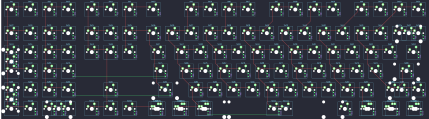

## xelus/kangaroo/kangaroo_rev1

[layout](kangaroo_rev1-kle.json) - [PCB](kangaroo_rev1.kicad_pcb)

{:loading="lazy"}

[Open in keyboard-layout-editor](http://www.keyboard-layout-editor.com/##@@_x:1.25;&=0,0&=1,0&=0,1&=1,1&_x:0.25&c=#aaaaaa;&=0,2&=1,2&=0,3&_x:0.25&c=#888888;&=1,3&_x:1.0&c=#cccccc;&=0,4&=1,4&=0,5&=1,5&_x:0.5&c=#aaaaaa;&=0,6&=1,6&=0,7&=1,7&_x:0.5&c=#cccccc;&=0,8&=1,8&=0,9&=1,9;&@_x:1.25&y:0.25&c=#aaaaaa;&=2,0&=3,0&=2,1&=3,1&_x:0.25;&=2,2&=3,2&=2,3&_x:0.25;&=3,3&_c=#cccccc;&=2,4&=3,4&=2,5&=3,5&=2,6&=3,6&=2,7&=3,7&=2,8&=3,8&=2,9&=3,9&_c=#aaaaaa&w:2;&=2,10%0A%0A%0A0,0;&@_x:1.25&h:2;&=6,0%0A%0A%0A2,0&_c=#cccccc;&=5,0&=4,1&=5,1&_x:0.25&c=#aaaaaa;&=4,2&=5,2&=4,3&_x:0.25&w:1.5;&=5,3&_c=#cccccc;&=4,4&=5,4&=4,5&=5,5&=4,6&=5,6&=4,7&=5,7&=4,8&=5,8&=4,9&=5,9&_w:1.5;&=4,10;&@_x:2.25;&=7,0&=6,1&=7,1&_x:3.5&c=#aaaaaa&w:1.75;&=7,3&_c=#cccccc;&=6,4&=7,4&=6,5&=7,5&=6,6&=7,6&=6,7&=7,7&=6,8&=7,8&=6,9&_c=#888888&w:2.25;&=7,9;&@_x:1.25&h:2;&=10,0%0A%0A%0A3,0&_c=#cccccc;&=9,0&=8,1&=9,1&_x:1.25&c=#aaaaaa;&=9,2&_x:1.25&w:2.25;&=9,3&_c=#cccccc;&=8,4&=9,4&=8,5&=9,5&=8,6&=9,6&=8,7&=9,7&=8,8&=9,8&_c=#aaaaaa&w:2.75;&=8,9%0A%0A%0A1,0;&@_x:2.25&c=#cccccc;&=11,0&_w:2;&=11,1%0A%0A%0A4,0&_x:0.25&c=#aaaaaa;&=10,2&=11,2&=10,3&_x:0.25&w:1.25;&=11,3%0A%0A%0A5,0&_w:1.25;&=10,4%0A%0A%0A5,0&_w:1.25;&=11,4%0A%0A%0A5,0&_c=#cccccc&w:6.25;&=11,6%0A%0A%0A5,0&_c=#aaaaaa&w:1.25;&=10,8%0A%0A%0A5,0&_w:1.25;&=11,8%0A%0A%0A5,0&_w:1.25;&=10,9%0A%0A%0A5,0&_w:1.25;&=11,9%0A%0A%0A5,0;&@_x:24.0&y:-5.0&c=#cccccc;&=2,10%0A%0A%0A0,1&=0,10%0A%0A%0A0,1;&@=4,0%0A%0A%0A2,1;&@=6,0%0A%0A%0A2,1;&@=8,0%0A%0A%0A3,1&_x:23.0&c=#aaaaaa&w:1.75;&=8,9%0A%0A%0A1,1&=9,9%0A%0A%0A1,1;&@_c=#cccccc;&=10,0%0A%0A%0A3,1;&@_x:3.25&y:0.25;&=10,1%0A%0A%0A4,1&=11,1%0A%0A%0A4,1&_x:3.5&c=#aaaaaa&w:1.5;&=11,3%0A%0A%0A5,1&=10,4%0A%0A%0A5,1&_w:1.5;&=11,4%0A%0A%0A5,1&_c=#cccccc&w:7;&=11,6%0A%0A%0A5,1&_c=#aaaaaa&w:1.5;&=11,8%0A%0A%0A5,1&=10,9%0A%0A%0A5,1&_w:1.5;&=11,9%0A%0A%0A5,1)

{:loading="lazy"}

