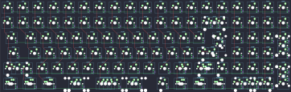

## xelus/snap96/xelus_snap96

[layout](xelus_snap96-kle.json) - [PCB](xelus_snap96.kicad_pcb)

{:loading="lazy"}

[Open in keyboard-layout-editor](http://www.keyboard-layout-editor.com/##@_name=Snap96;&@_x:2.75&y:1&c=#888888;&=0,0&_c=#aaaaaa;&=0,1&=0,2&=0,3&=0,4&=0,5&=0,6&=0,7&=0,8&=0,9&=6,0&=6,1&=6,2&=6,3&=6,4&=6,5&=6,6&=6,7&=6,8;&@_x:2.75&c=#cccccc;&=1,0&=1,1&=1,2&=1,3&=1,4&=1,5&=1,6&=1,7&=1,8&=1,9&=7,0&=7,1&=7,2&_c=#aaaaaa&w:2;&=7,4%0A%0A%0A0,0&=7,5&=7,6&=7,7&=7,8;&@_x:2.75&w:1.5;&=2,0&_c=#cccccc;&=2,1&=2,2&=2,3&=2,4&=2,5&=2,6&=2,7&=2,8&=2,9&=8,0&=8,1&=8,2&_w:1.5;&=8,4%0A%0A%0A1,0&=8,5&=8,6&=8,7&_c=#aaaaaa&h:2;&=9,8%0A%0A%0A5,0;&@_x:2.75&w:1.75;&=3,0&_c=#cccccc;&=3,1&=3,2&=3,3&=3,4&=3,5&=3,6&=3,7&=3,8&=3,9&=9,0&=9,1&_c=#888888&w:2.25;&=9,3%0A%0A%0A1,0&_c=#cccccc;&=9,5&=9,6&=9,7;&@_x:2.75&c=#aaaaaa&w:2.25;&=4,0%0A%0A%0A2,0&_c=#cccccc;&=4,2&=4,3&=4,4&=4,5&=4,6&=4,7&=4,8&=4,9&=10,0&=10,1%0A%0A%0A3,0&_c=#aaaaaa&w:1.75;&=10,3%0A%0A%0A3,0&=10,4%0A%0A%0A3,0&_c=#cccccc;&=10,5&=10,6&=10,7&_c=#888888&h:2;&=11,8%0A%0A%0A6,0;&@_x:2.75&c=#aaaaaa&w:1.5;&=5,0%0A%0A%0A4,0&=5,1%0A%0A%0A4,0&_w:1.5;&=5,2%0A%0A%0A4,0&_c=#cccccc&w:7;&=5,6%0A%0A%0A4,0&_c=#aaaaaa&w:1.5;&=11,1%0A%0A%0A4,0&=11,3%0A%0A%0A4,0&_w:1.5;&=11,4%0A%0A%0A4,0&_c=#cccccc;&=11,5%0A%0A%0A7,0&=11,6%0A%0A%0A7,0&=11,7%0A%0A%0A7,0;&@_x:15.75&y:-7;&=7,3%0A%0A%0A0,1&=7,4%0A%0A%0A0,1;&@_x:23.25&y:1&c=#888888&w:1.25&h:2&w2:1.5&h2:1&x2:-0.25;&=8,4%0A%0A%0A1,1;&@_x:22.25&c=#cccccc;&=9,3%0A%0A%0A1,1&_x:3.25&c=#aaaaaa;&=8,8%0A%0A%0A5,1;&@_x:22.25&c=#cccccc;&=10,1%0A%0A%0A3,1&_c=#aaaaaa&w:2.75;&=10,3%0A%0A%0A3,1&_x:0.5;&=8,9%0A%0A%0A5,1;&@_w:1.25;&=4,0%0A%0A%0A2,1&_c=#cccccc;&=4,1%0A%0A%0A2,1&_x:20.0&c=#aaaaaa&w:1.75;&=10,1%0A%0A%0A3,2&_c=#cccccc;&=10,3%0A%0A%0A3,2&=10,4%0A%0A%0A3,2&_x:0.5&c=#aaaaaa;&=10,8%0A%0A%0A6,1;&@_x:26.5;&=11,8%0A%0A%0A6,1;&@_x:2.75&y:0.5&w:1.25;&=5,0%0A%0A%0A4,1&_w:1.25;&=5,1%0A%0A%0A4,1&_w:1.25;&=5,2%0A%0A%0A4,1&_c=#cccccc&w:6.25;&=5,6%0A%0A%0A4,1&_c=#aaaaaa&w:1.25;&=11,0%0A%0A%0A4,1&_w:1.25;&=11,1%0A%0A%0A4,1&_w:1.25;&=11,3%0A%0A%0A4,1&_w:1.25;&=11,4%0A%0A%0A4,1&_x:0.5&c=#cccccc&w:2;&=11,5%0A%0A%0A7,1&=11,7%0A%0A%0A7,1;&@_x:2.75&c=#aaaaaa&w:1.25;&=5,0%0A%0A%0A4,2&_w:1.25;&=5,1%0A%0A%0A4,2&_w:1.25;&=5,2%0A%0A%0A4,2&_c=#cccccc&w:2.75;&=5,5%0A%0A%0A4,2&_w:1.25;&=5,6%0A%0A%0A4,2&_w:2.25;&=5,9%0A%0A%0A4,2&_c=#aaaaaa&w:1.25;&=11,0%0A%0A%0A4,2&_w:1.25;&=11,1%0A%0A%0A4,2&_w:1.25;&=11,3%0A%0A%0A4,2&_w:1.25;&=11,4%0A%0A%0A4,2&_x:0.5&c=#cccccc;&=11,5%0A%0A%0A7,2&_w:2;&=11,7%0A%0A%0A7,2;&@_x:2.75&c=#aaaaaa&w:1.25;&=5,0%0A%0A%0A4,3&_w:1.25;&=5,1%0A%0A%0A4,3&_w:1.25;&=5,2%0A%0A%0A4,3&_c=#cccccc&w:2.25;&=5,5%0A%0A%0A4,3&_w:1.25;&=5,6%0A%0A%0A4,3&_w:2.75;&=5,9%0A%0A%0A4,3&_c=#aaaaaa&w:1.25;&=11,0%0A%0A%0A4,3&_w:1.25;&=11,1%0A%0A%0A4,3&_w:1.25;&=11,3%0A%0A%0A4,3&_w:1.25;&=11,4%0A%0A%0A4,3)

{:loading="lazy"}

