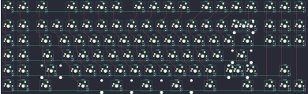

## xelus/trinityxttkl/xelus_trinityxttkl

[layout](xelus_trinityxttkl-kle.json) - [PCB](xelus_trinityxttkl.kicad_pcb)

{:loading="lazy"}

[Open in keyboard-layout-editor](http://www.keyboard-layout-editor.com/##@@_c=#aaaaaa;&=0,0&=0,1&_x:0.25&c=#888888;&=0,2&_x:1.0&c=#cccccc;&=0,4&=0,5&=0,6&=0,7&_x:0.5&c=#aaaaaa;&=0,8&=0,9&=0,10&=0,11&_x:0.5&c=#cccccc;&=0,12&=0,13&=0,14&=0,15&_x:0.25&c=#aaaaaa;&=0,16&=0,17&=0,18;&@_y:0.25;&=1,0&=1,1&_x:0.25&c=#cccccc;&=1,2&=1,3&=1,4&=1,5&=1,6&=1,7&=1,8&=1,9&=1,10&=1,11&=1,12&=1,13&=1,14&_c=#aaaaaa&w:2;&=1,15%0A%0A%0A0,0&_x:0.25;&=1,16&=1,17&=1,18;&@=2,0&=2,1&_x:0.25&w:1.5;&=2,2&_c=#cccccc;&=2,3&=2,4&=2,5&=2,6&=2,7&=2,8&=2,9&=2,10&=2,11&=2,12&=2,13&=2,14&_w:1.5;&=2,15&_x:0.25&c=#aaaaaa;&=2,16&=2,17&=2,18;&@=3,0&=3,1&_x:0.25&w:1.75;&=3,2&_c=#cccccc;&=3,3&=3,4&=3,5&=3,6&=3,7&=3,8&=3,9&=3,10&=3,11&=3,12&=3,13&_c=#aaaaaa&w:2.25;&=3,14;&@=4,0&=4,1&_x:0.25&w:2.25;&=4,2&_c=#cccccc;&=4,3&=4,4&=4,5&=4,6&=4,7&=4,8&=4,9&=4,10&=4,11&=4,12&_c=#aaaaaa&w:2.75;&=4,14%0A%0A%0A1,0&_x:1.25;&=4,17;&@=5,0&=5,1&_x:0.25&w:1.5;&=5,2&_x:1.0&w:1.5;&=5,3&_c=#cccccc&w:7;&=5,5%0A%0A%0A2,0&_c=#aaaaaa&w:1.5;&=5,12&_x:1.0&w:1.5;&=5,15&_x:0.25;&=5,16&=5,17&=5,18;&@_x:21.0&y:-5.0&c=#cccccc;&=1,15%0A%0A%0A0,1&=3,15%0A%0A%0A0,1;&@_x:21.0&y:2.0&c=#aaaaaa&w:1.75;&=4,14%0A%0A%0A1,1&=4,15%0A%0A%0A1,1;&@_x:6.25&y:1.5&c=#cccccc&w:3;&=5,4%0A%0A%0A2,1&=5,5%0A%0A%0A2,1&_w:3;&=5,11%0A%0A%0A2,1)

{:loading="lazy"}

