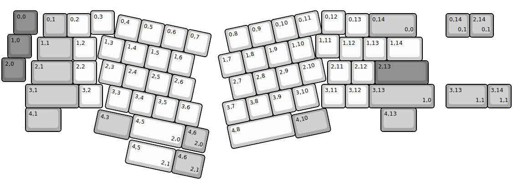
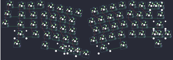

## xelus/valor/rev1/xelus_valor_rev1

[layout](xelus_valor_rev1-kle.json) - [PCB](xelus_valor_rev1.kicad_pcb)

{:loading="lazy"}

[Open in keyboard-layout-editor](http://www.keyboard-layout-editor.com/##@@_x:0.5&y:0.38&c=#777777;&=0,0&_x:2.25&c=#cccccc;&=0,3&_x:8.75;&=0,12;&@_x:1.75&y:-0.88&c=#aaaaaa;&=0,1&_c=#cccccc;&=0,2&_x:10.75;&=0,13&_c=#aaaaaa&w:2;&=0,14%0A%0A%0A0,0;&@_x:0.25&y:-0.12&c=#777777;&=1,0&_x:12.0&c=#cccccc;&=1,11;&@_x:1.5&y:-0.88&c=#aaaaaa&w:1.5;&=1,1&_c=#cccccc;&=1,2&_x:10.25;&=1,12&=1,13&_w:1.5;&=1,14;&@_y:-0.12&c=#777777;&=2,0;&@_x:1.25&y:-0.88&c=#aaaaaa&w:1.75;&=2,1&_c=#cccccc;&=2,2&_x:9.75;&=2,11&=2,12&_c=#777777&w:2.25;&=2,13;&@_x:1&c=#aaaaaa&w:2.25;&=3,1&_c=#cccccc;&=3,2&_x:9.25;&=3,11&=3,12&_c=#aaaaaa&w:2.75;&=3,13%0A%0A%0A1,0;&@_x:1&w:1.5;&=4,1&_x:13.5&w:1.5;&=4,13;&@_r:12&rx:4.75&ry:1.5&y:-1.0&c=#cccccc;&=0,4&=0,5&=0,6&=0,7;&@_x:-0.5;&=1,3&=1,4&=1,5&=1,6;&@_x:-0.25;&=2,3&=2,4&=2,5&=2,6;&@_x:0.25;&=3,3&=3,4&=3,5&=3,6;&@_x:1.5&w:2.25;&=4,5%0A%0A%0A2,0&_c=#aaaaaa;&=4,6%0A%0A%0A2,0;&@_y:-0.88&w:1.5;&=4,3;&@_r:-12&rx:14&ry:1.25&x:-4.5&y:-1.0&c=#cccccc;&=0,8&=0,9&=0,10&=0,11;&@_x:-5;&=1,7&=1,8&=1,9&=1,10;&@_x:-4.75;&=2,7&=2,8&=2,9&=2,10;&@_x:-5.25;&=3,7&=3,8&=3,9&=3,10;&@_x:-5.25&w:2.75;&=4,8;&@_x:-2.5&y:-0.87&c=#aaaaaa&w:1.5;&=4,10;&@_r:0&rx:0&ry:0&x:18.75&y:0.5;&=0,14%0A%0A%0A0,1&=2,14%0A%0A%0A0,1;&@_x:18.75&y:2.0&w:1.75;&=3,13%0A%0A%0A1,1&=3,14%0A%0A%0A1,1;&@_r:12&rx:3.75&ry:6.5&x:1.5&y:-1.0&c=#cccccc&w:2;&=4,5%0A%0A%0A2,1&_c=#aaaaaa&w:1.25;&=4,6%0A%0A%0A2,1)

{:loading="lazy"}

