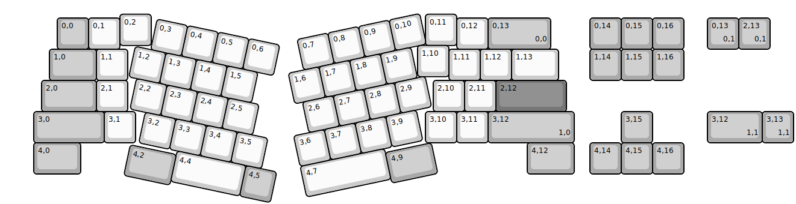
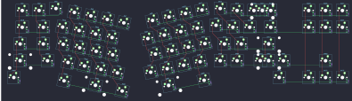

## xelus/valor_frl_tkl

[layout](valor_frl_tkl-kle.json) - [PCB](valor_frl_tkl.kicad_pcb)

{:loading="lazy"}

[Open in keyboard-layout-editor](http://www.keyboard-layout-editor.com/##@@_x:3.75&y:0.38;&=0,2&_x:8.75;&=0,11;&@_x:1.75&y:-0.88&c=#aaaaaa;&=0,0&_c=#cccccc;&=0,1&_x:10.75;&=0,12&_c=#aaaaaa&w:2;&=0,13%0A%0A%0A0,0&_x:1.25;&=0,14&=0,15&=0,16;&@_x:13.25&y:-0.12&c=#cccccc;&=1,10;&@_x:1.5&y:-0.88&c=#aaaaaa&w:1.5;&=1,0&_c=#cccccc;&=1,1&_x:10.25;&=1,11&=1,12&_w:1.5;&=1,13&_x:1.0&c=#aaaaaa;&=1,14&=1,15&=1,16;&@_x:1.25&w:1.75;&=2,0&_c=#cccccc;&=2,1&_x:9.75;&=2,10&=2,11&_c=#777777&w:2.25;&=2,12;&@_x:1&c=#aaaaaa&w:2.25;&=3,0&_c=#cccccc;&=3,1&_x:9.25;&=3,10&=3,11&_c=#aaaaaa&w:2.75;&=3,12%0A%0A%0A1,0&_x:1.5;&=3,15;&@_x:1&w:1.5;&=4,0&_x:14.25&w:1.5;&=4,12&_x:0.5;&=4,14&=4,15&=4,16;&@_r:12&rx:4.75&ry:1.5&y:-1.0&c=#cccccc;&=0,3&=0,4&=0,5&=0,6;&@_x:-0.5;&=1,2&=1,3&=1,4&=1,5;&@_x:-0.25;&=2,2&=2,3&=2,4&=2,5;&@_x:0.25;&=3,2&=3,3&=3,4&=3,5;&@_x:1.5&w:2.25;&=4,4&_c=#aaaaaa;&=4,5;&@_y:-0.88&w:1.5;&=4,2;&@_r:-12&rx:14&ry:1.25&x:-4.5&y:-1.0&c=#cccccc;&=0,7&=0,8&=0,9&=0,10;&@_x:-5;&=1,6&=1,7&=1,8&=1,9;&@_x:-4.75;&=2,6&=2,7&=2,8&=2,9;&@_x:-5.25;&=3,6&=3,7&=3,8&=3,9;&@_x:-5.25&w:2.75;&=4,7;&@_x:-2.5&y:-0.87&c=#aaaaaa&w:1.5;&=4,9;&@_r:0&rx:0&ry:0&x:22.5&y:0.5;&=0,13%0A%0A%0A0,1&=2,13%0A%0A%0A0,1;&@_x:22.5&y:2.0&w:1.75;&=3,12%0A%0A%0A1,1&=3,13%0A%0A%0A1,1)

{:loading="lazy"}

