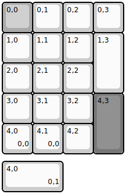
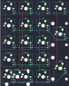

## yampad/yampad

[layout](yampad-kle.json) - [PCB](yampad.kicad_pcb)

{:loading="lazy"}

[Open in keyboard-layout-editor](http://www.keyboard-layout-editor.com/##@@_c=#aaaaaa;&=0,0%0ANum%20Lock&_c=#cccccc;&=0,1%0A//&=0,2%0A*&=0,3%0A-;&@=1,0%0A7&=1,1%0A8%0A%E2%86%91&=1,2%0A9&_h:2;&=1,3%0A+;&@=2,0%0A4%0A%E2%86%90&=2,1%0A5&=2,2%0A6%0A%E2%86%92;&@=3,0%0A1&=3,1%0A2%0A%E2%86%93&=3,2%0A3&_c=#777777&h:2;&=4,3%0AEnter;&@_c=#cccccc;&=4,0%0A0%0AIns%0A0,0&=4,1%0A00%0A%0A0,0&=4,2%0A.%0ADel;&@_y:0.25&w:2;&=4,0%0A0%0AIns%0A0,1)

{:loading="lazy"}

