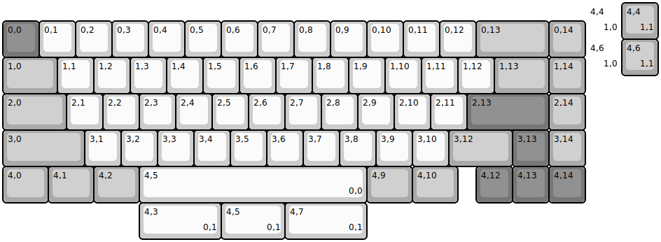
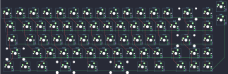

## yandrstudio/nz67v2

[layout](nz67v2-kle.json) - [PCB](nz67v2.kicad_pcb)

{:loading="lazy"}

[Open in keyboard-layout-editor](http://www.keyboard-layout-editor.com/##@@_x:16&d:true;&=4,4%0A%0A%0A1,0;&@_y:-0.5&c=#777777;&=0,0&_c=#cccccc;&=0,1&=0,2&=0,3&=0,4&=0,5&=0,6&=0,7&=0,8&=0,9&=0,10&=0,11&=0,12&_c=#aaaaaa&w:2;&=0,13&=0,14;&@_x:16&y:-0.5&c=#cccccc&d:true;&=4,6%0A%0A%0A1,0;&@_y:-0.5&c=#aaaaaa&w:1.5;&=1,0&_c=#cccccc;&=1,1&=1,2&=1,3&=1,4&=1,5&=1,6&=1,7&=1,8&=1,9&=1,10&=1,11&=1,12&_c=#aaaaaa&w:1.5;&=1,13&=1,14;&@_w:1.75;&=2,0&_c=#cccccc;&=2,1&=2,2&=2,3&=2,4&=2,5&=2,6&=2,7&=2,8&=2,9&=2,10&=2,11&_c=#777777&w:2.25;&=2,13&_c=#aaaaaa;&=2,14;&@_w:2.25;&=3,0&_c=#cccccc;&=3,1&=3,2&=3,3&=3,4&=3,5&=3,6&=3,7&=3,8&=3,9&=3,10&_c=#aaaaaa&f:1&w:1.75;&=3,12&_c=#777777&f:3;&=3,13&_c=#aaaaaa;&=3,14;&@_w:1.25;&=4,0&_w:1.25;&=4,1&_w:1.25;&=4,2&_c=#cccccc&w:6.25;&=4,5%0A%0A%0A0,0&_c=#aaaaaa&w:1.25;&=4,9&_w:1.25;&=4,10&_x:0.5&c=#777777;&=4,12&=4,13&=4,14;&@_x:17&y:-5.5&c=#aaaaaa;&=4,4%0A%0A%0A1,1;&@_x:17;&=4,6%0A%0A%0A1,1;&@_x:3.75&y:3.5&c=#cccccc&w:2.25;&=4,3%0A%0A%0A0,1&_w:1.75;&=4,5%0A%0A%0A0,1&_w:2.25;&=4,7%0A%0A%0A0,1)

{:loading="lazy"}

