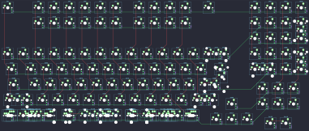

## ydkb/grape

[layout](grape-kle.json) - [PCB](grape.kicad_pcb)

{:loading="lazy"}

[Open in keyboard-layout-editor](http://www.keyboard-layout-editor.com/##@@_c=#777777;&=0,0&_x:1&c=#cccccc;&=0,2&=0,3&=0,4&=0,5&=0,6&=0,7&_x:0.5;&=0,8&=0,9&=0,10&=0,11&_x:0.5;&=0,13&_x:2.0&c=#aaaaaa;&=0,14&=0,15&=0,16&=0,17;&@_x:2&c=#cccccc;&=1,2&=1,3&=1,4&=1,5&=1,6&=1,7&_x:0.5;&=1,8&=1,9&=1,10&=1,11&_x:3.5;&=1,14&=1,15&=1,16&_c=#aaaaaa&h:2;&=1,17%0A%0A%0A4,0;&@_x:16&c=#cccccc;&=2,14&=2,15&=2,16;&@=2,0&=2,1&=2,2&=2,3&=2,4&=2,5&=2,6&=2,7&=2,8&=2,9&=2,10&=2,11&=2,12&_c=#aaaaaa&w:2;&=2,13%0A%0A%0A0,0&_x:1&c=#cccccc;&=3,14&=3,15&=3,16&_c=#aaaaaa&h:2;&=3,17%0A%0A%0A5,0;&@_w:1.5;&=3,0&_c=#cccccc;&=3,1&=3,2&=3,3&=3,4&=3,5&=3,6&=3,7&=3,8&=3,9&=3,10&=3,11&=3,12&_w:1.5;&=3,13%0A%0A%0A1,0&_x:1.0&w:2;&=4,14%0A%0A%0A6,0&=4,16;&@_c=#aaaaaa&w:1.75;&=4,0&_c=#cccccc;&=4,1&=4,2&=4,3&=4,4&=4,5&=4,6&=4,7&=4,8&=4,9&=4,10&=4,11&_c=#777777&w:2.25;&=4,13%0A%0A%0A1,0;&@_x:16.5&y:-0.75&c=#cccccc;&=5,15&=5,16&=5,17;&@_y:-0.25&c=#aaaaaa&w:2.25;&=5,0%0A%0A%0A2,0&_c=#cccccc;&=5,2&=5,3&=5,4&=5,5&=5,6&=5,7&=5,8&=5,9&=5,10&=5,11&_c=#aaaaaa&w:2;&=5,12%0A%0A%0A3,0;&@_x:14.5&y:-0.75;&=5,13&_x:1.0&c=#cccccc;&=6,15&=6,16&=6,17;&@_y:-0.25&c=#aaaaaa;&=6,0%0A%0A%0A7,0&=6,1%0A%0A%0A7,0&=6,2%0A%0A%0A7,0&_c=#cccccc&w:6;&=6,5%0A%0A%0A7,0&_c=#aaaaaa;&=6,7%0A%0A%0A7,0&=6,8%0A%0A%0A7,0&=6,9%0A%0A%0A7,0&=6,10%0A%0A%0A7,0;&@_x:13.5&y:-0.75;&=6,11&=6,12&=6,13;&@_x:17&y:-0.5&c=#cccccc&h:0.5;&=5,14&_h:0.5;&=6,14;&@_y:-0.5&c=#aaaaaa&w:1.5;&=6,0%0A%0A%0A7,1&=6,1%0A%0A%0A7,1&_w:1.5;&=6,2%0A%0A%0A7,1&_c=#cccccc&w:6;&=6,5%0A%0A%0A7,1&_c=#aaaaaa&w:1.5;&=6,8%0A%0A%0A7,1&_w:1.5;&=6,10%0A%0A%0A7,1;&@_x:13.5&y:-0.75&w:1.25;&=5,0%0A%0A%0A2,1&_c=#cccccc;&=5,1%0A%0A%0A2,1&_x:3.25&c=#aaaaaa;&=1,17%0A%0A%0A4,1;&@_y:-0.25&w:1.25;&=6,0%0A%0A%0A7,2&_w:1.25;&=6,1%0A%0A%0A7,2&_w:1.25;&=6,2%0A%0A%0A7,2&_c=#cccccc&w:6.25;&=6,5%0A%0A%0A7,2&_c=#aaaaaa&w:1.5;&=6,8%0A%0A%0A7,2&_w:1.5;&=6,10%0A%0A%0A7,2;&@_x:19&y:-0.75;&=2,17%0A%0A%0A4,1;&@_x:13.75&y:-0.75;&=2,13%0A%0A%0A0,1&=1,13%0A%0A%0A0,1;&@_y:-0.5;&=6,0%0A%0A%0A7,3&=6,1%0A%0A%0A7,3&=6,2%0A%0A%0A7,3&_c=#cccccc&w:7;&=6,5%0A%0A%0A7,3&_c=#aaaaaa;&=6,8%0A%0A%0A7,3&=6,9%0A%0A%0A7,3&=6,10%0A%0A%0A7,3;&@_x:14.5&y:-0.5&c=#777777&w:1.25&h:2&w2:1.5&h2:1&x2:-0.25;&=3,13%0A%0A%0A1,1;&@_x:19&y:-0.75&c=#aaaaaa;&=3,17%0A%0A%0A5,1;&@_y:-0.75&w:1.5;&=6,0%0A%0A%0A7,4&_w:1.5;&=6,2%0A%0A%0A7,4&_c=#cccccc&w:7;&=6,5%0A%0A%0A7,4&_c=#aaaaaa&w:1.5;&=6,8%0A%0A%0A7,4&_w:1.5;&=6,10%0A%0A%0A7,4;&@_x:13.5&y:-0.5&c=#cccccc;&=4,13%0A%0A%0A1,1;&@_x:16.75&y:-0.75;&=4,14%0A%0A%0A6,1&=4,15%0A%0A%0A6,1&_x:0.25&c=#aaaaaa;&=4,17%0A%0A%0A5,1;&@_y:-0.75&w:1.5;&=6,0%0A%0A%0A7,5&_w:1.5;&=6,2%0A%0A%0A7,5&_c=#cccccc&w:3;&=6,4%0A%0A%0A7,5&_w:3;&=6,5%0A%0A%0A7,5&_c=#aaaaaa;&=6,7%0A%0A%0A7,5&_w:1.5;&=6,8%0A%0A%0A7,5&_w:1.5;&=6,10%0A%0A%0A7,5;&@_x:13.75&y:-0.5;&=4,12%0A%0A%0A3,1&=5,12%0A%0A%0A3,1;&@_y:-0.5&w:1.5;&=6,0%0A%0A%0A7,6&=6,1%0A%0A%0A7,6&_w:1.5;&=6,2%0A%0A%0A7,6&_c=#cccccc&w:3;&=6,4%0A%0A%0A7,6&_w:3;&=6,5%0A%0A%0A7,6&_c=#aaaaaa&w:1.5;&=6,8%0A%0A%0A7,6&_w:1.5;&=6,10%0A%0A%0A7,6;&@_w:1.25;&=6,0%0A%0A%0A7,7&_w:1.25;&=6,1%0A%0A%0A7,7&_w:1.25;&=6,2%0A%0A%0A7,7&_w:1.25;&=6,4%0A%0A%0A7,7&_c=#cccccc&w:3;&=6,5%0A%0A%0A7,7&_c=#aaaaaa&w:1.25;&=6,7%0A%0A%0A7,7&_w:1.25;&=6,8%0A%0A%0A7,7&_w:1.25;&=6,9%0A%0A%0A7,7&_w:1.25;&=6,10%0A%0A%0A7,7;&@_w:1.5;&=6,0%0A%0A%0A7,8&=6,1%0A%0A%0A7,8&_w:1.5;&=6,2%0A%0A%0A7,8&=6,4%0A%0A%0A7,8&_c=#cccccc&w:3;&=6,5%0A%0A%0A7,8&_c=#aaaaaa;&=6,7%0A%0A%0A7,8&_w:1.5;&=6,8%0A%0A%0A7,8&=6,9%0A%0A%0A7,8&_w:1.5;&=6,10%0A%0A%0A7,8)

{:loading="lazy"}

