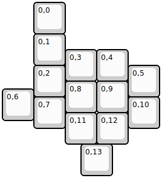

## yeehaw/yeehaw

[layout](yeehaw-kle.json) - [PCB](yeehaw.kicad_pcb)

{:loading="lazy"}

[Open in keyboard-layout-editor](http://www.keyboard-layout-editor.com/##@@_x:1;&=0,0;&@_x:1;&=0,1;&@_x:2&y:-0.5;&=0,3&=0,4;&@_x:1&y:-0.5;&=0,2&_x:2;&=0,5;&@_x:2&y:-0.5;&=0,8&=0,9;&@_y:-0.75;&=0,6;&@_x:1&y:-0.75;&=0,7&_x:2;&=0,10;&@_x:2&y:-0.5;&=0,11&=0,12;&@_x:2.5;&=0,13)

{:loading="lazy"}

