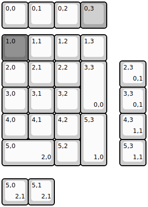
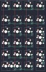

## yiancardesigns/allison_numpad

[layout](allison_numpad-kle.json) - [PCB](allison_numpad.kicad_pcb)

{:loading="lazy"}

[Open in keyboard-layout-editor](http://www.keyboard-layout-editor.com/##@@=0,0&=0,1&=0,2&_c=#aaaaaa;&=0,3;&@_y:0.25&c=#777777;&=1,0&_c=#cccccc;&=1,1&=1,2&=1,3;&@=2,0&=2,1&=2,2&_h:2;&=3,3%0A%0A%0A0,0;&@=3,0&=3,1&=3,2;&@=4,0&=4,1&=4,2&_h:2;&=5,3%0A%0A%0A1,0;&@_w:2;&=5,0%0A%0A%0A2,0&=5,2;&@_x:4.5&y:-4.0;&=2,3%0A%0A%0A0,1;&@_x:4.5;&=3,3%0A%0A%0A0,1;&@_x:4.5;&=4,3%0A%0A%0A1,1;&@_x:4.5;&=5,3%0A%0A%0A1,1;&@_y:0.5;&=5,0%0A%0A%0A2,1&=5,1%0A%0A%0A2,1)

{:loading="lazy"}

