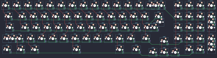

## yiancardesigns/barleycorn

[layout](barleycorn-kle.json) - [PCB](barleycorn.kicad_pcb)

{:loading="lazy"}

[Open in keyboard-layout-editor](http://www.keyboard-layout-editor.com/##@@_c=#777777;&=0,0&_c=#cccccc;&=0,1&=0,2&=0,3&=0,4&=0,5&=0,6&=0,7&=0,8&=0,9&=0,10&=0,11&=0,12&_c=#aaaaaa&w:2;&=0,13%0A%0A%0A0,0&_x:0.5&c=#cccccc;&=0,14&=0,15&=0,16&=0,17;&@_c=#aaaaaa&w:1.5;&=1,0&_c=#cccccc;&=1,1&=1,2&=1,3&=1,4&=1,5&=1,6&=1,7&=1,8&=1,9&=1,10&=1,11&=1,12&_w:1.5;&=2,12%0A%0A%0A1,0&_x:0.5;&=1,14&=1,15&=1,16&_h:2;&=2,17%0A%0A%0A3,0;&@_c=#aaaaaa&w:1.75;&=2,0&_c=#cccccc;&=2,1&=2,2&=2,3&=2,4&=2,5&=2,6&=2,7&=2,8&=2,9&=2,10&=2,11&_c=#aaaaaa&w:2.25;&=2,13%0A%0A%0A1,0&_x:0.5&c=#cccccc;&=2,14&=2,15&=2,16;&@_c=#aaaaaa&w:2.25;&=3,0%0A%0A%0A2,0&_c=#cccccc;&=3,2&=3,3&=3,4&=3,5&=3,6&=3,7&=3,8&=3,9&=3,10&=3,11&_c=#aaaaaa&w:1.75;&=3,12&_x:1.5&c=#cccccc;&=3,14&=3,15&=3,16&_c=#777777&h:2;&=4,17%0A%0A%0A4,0;&@_x:14.25&y:-0.75&c=#cccccc;&=3,13;&@_y:-0.25&c=#aaaaaa&w:1.25;&=4,0&_w:1.25;&=4,1&_w:1.25;&=4,2&_c=#777777&w:6.25;&=4,6&_c=#aaaaaa&w:1.5;&=4,10&_w:1.5;&=4,11&_x:3.5&c=#cccccc;&=4,15&=4,16;&@_x:13.25&y:-0.75;&=4,12&=4,13&=4,14;&@_y:0.25&c=#aaaaaa&w:1.25;&=3,0%0A%0A%0A2,1&_c=#cccccc;&=3,1%0A%0A%0A2,1&_x:10.75&c=#aaaaaa;&=0,13%0A%0A%0A0,1&=1,13%0A%0A%0A0,1&_x:3.5&c=#cccccc;&=1,17%0A%0A%0A3,1;&@_x:13.75&c=#aaaaaa&w:1.25&h:2&w2:1.5&h2:1&x2:-0.25;&=2,13%0A%0A%0A1,1&_x:3.5&c=#cccccc;&=2,17%0A%0A%0A3,1;&@_x:12.75;&=2,12%0A%0A%0A1,1&_x:4.75;&=3,17%0A%0A%0A4,1;&@_x:18.5&c=#777777;&=4,17%0A%0A%0A4,1)

{:loading="lazy"}

