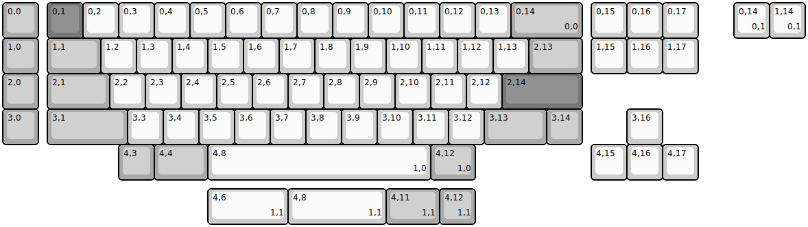
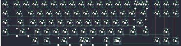

## yiancardesigns/cyberstar

[layout](cyberstar-kle.json) - [PCB](cyberstar.kicad_pcb)

{:loading="lazy"}

[Open in keyboard-layout-editor](http://www.keyboard-layout-editor.com/##@@_c=#aaaaaa;&=0,0&_x:0.25&c=#777777;&=0,1&_c=#cccccc;&=0,2&=0,3&=0,4&=0,5&=0,6&=0,7&=0,8&=0,9&=0,10&=0,11&=0,12&=0,13&_c=#aaaaaa&w:2;&=0,14%0A%0A%0A0,0&_x:0.25&c=#cccccc;&=0,15&=0,16&=0,17;&@_c=#aaaaaa;&=1,0&_x:0.25&w:1.5;&=1,1&_c=#cccccc;&=1,2&=1,3&=1,4&=1,5&=1,6&=1,7&=1,8&=1,9&=1,10&=1,11&=1,12&=1,13&_c=#aaaaaa&w:1.5;&=2,13&_x:0.25&c=#cccccc;&=1,15&=1,16&=1,17;&@_c=#aaaaaa;&=2,0&_x:0.25&w:1.75;&=2,1&_c=#cccccc;&=2,2&=2,3&=2,4&=2,5&=2,6&=2,7&=2,8&=2,9&=2,10&=2,11&=2,12&_c=#777777&w:2.25;&=2,14;&@_c=#aaaaaa;&=3,0&_x:0.25&w:2.25;&=3,1&_c=#cccccc;&=3,3&=3,4&=3,5&=3,6&=3,7&=3,8&=3,9&=3,10&=3,11&=3,12&_c=#aaaaaa&w:1.75;&=3,13&=3,14&_x:1.25&c=#cccccc;&=3,16;&@_x:3.25&c=#aaaaaa;&=4,3&_w:1.5;&=4,4&_c=#cccccc&w:6.25;&=4,8%0A%0A%0A1,0&_c=#aaaaaa&w:1.25;&=4,12%0A%0A%0A1,0&_x:3.25&c=#cccccc;&=4,15&=4,16&=4,17;&@_x:20.5&y:-5;&=0,14%0A%0A%0A0,1&=1,14%0A%0A%0A0,1;&@_x:5.75&y:4.25&w:2.25;&=4,6%0A%0A%0A1,1&_w:2.75;&=4,8%0A%0A%0A1,1&_c=#aaaaaa&w:1.5;&=4,11%0A%0A%0A1,1&=4,12%0A%0A%0A1,1)

{:loading="lazy"}

