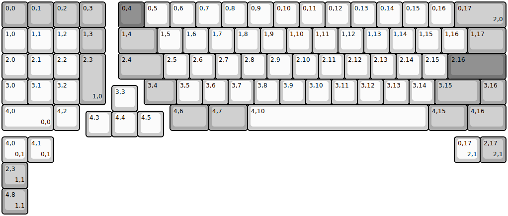
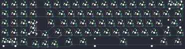

## yiancardesigns/mnk1800s

[layout](mnk1800s-kle.json) - [PCB](mnk1800s.kicad_pcb)

{:loading="lazy"}

[Open in keyboard-layout-editor](http://www.keyboard-layout-editor.com/##@@_c=#aaaaaa;&=0,0&=0,1&=0,2&=0,3&_x:0.5&c=#777777;&=0,4&_c=#cccccc;&=0,5&=0,6&=0,7&=0,8&=0,9&=0,10&=0,11&=0,12&=0,13&=0,14&=0,15&=0,16&_c=#aaaaaa&w:2;&=0,17%0A%0A%0A2,0;&@_c=#cccccc;&=1,0&=1,1&=1,2&_c=#aaaaaa;&=1,3&_x:0.5&w:1.5;&=1,4&_c=#cccccc;&=1,5&=1,6&=1,7&=1,8&=1,9&=1,10&=1,11&=1,12&=1,13&=1,14&=1,15&=1,16&_c=#aaaaaa&w:1.5;&=1,17;&@_c=#cccccc;&=2,0&=2,1&=2,2&_c=#aaaaaa&h:2;&=2,3%0A%0A%0A1,0&_x:0.5&w:1.75;&=2,4&_c=#cccccc;&=2,5&=2,6&=2,7&=2,8&=2,9&=2,10&=2,11&=2,12&=2,13&=2,14&=2,15&_c=#777777&w:2.25;&=2,16;&@_c=#cccccc;&=3,0&=3,1&=3,2&_x:2.5&c=#aaaaaa&w:1.25;&=3,4&_c=#cccccc;&=3,5&=3,6&=3,7&=3,8&=3,9&=3,10&=3,11&=3,12&=3,13&=3,14&_c=#aaaaaa&w:1.75;&=3,15&=3,16;&@_x:4.25&y:-0.75&c=#cccccc;&=3,3;&@_y:-0.25&w:2;&=4,0%0A%0A%0A0,0&=4,2&_x:3.5&c=#aaaaaa&w:1.5;&=4,6&_w:1.5;&=4,7&_c=#cccccc&w:7;&=4,10&_c=#aaaaaa&w:1.5;&=4,15&_w:1.5;&=4,16;&@_x:3.25&y:-0.75&c=#cccccc;&=4,3&=4,4&=4,5;&@=4,0%0A%0A%0A0,1&=4,1%0A%0A%0A0,1&_x:15.5;&=0,17%0A%0A%0A2,1&_c=#aaaaaa;&=2,17%0A%0A%0A2,1;&@=2,3%0A%0A%0A1,1;&@=4,8%0A%0A%0A1,1)

{:loading="lazy"}

