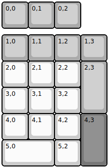

## yiancardesigns/nk20

[layout](nk20-kle.json) - [PCB](nk20.kicad_pcb)

{:loading="lazy"}

[Open in keyboard-layout-editor](http://www.keyboard-layout-editor.com/##@@_c=#aaaaaa;&=0,0&=0,1&=0,2;&@_y:0.25;&=1,0&=1,1&=1,2&=1,3;&@_c=#cccccc;&=2,0&=2,1&=2,2&_c=#aaaaaa&h:2;&=2,3;&@_c=#cccccc;&=3,0&=3,1&=3,2;&@=4,0&=4,1&=4,2&_c=#777777&h:2;&=4,3;&@_c=#cccccc&w:2;&=5,0&=5,2)

{:loading="lazy"}

