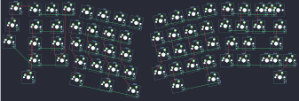

## yiancardesigns/seigaiha

[layout](seigaiha-kle.json) - [PCB](seigaiha.kicad_pcb)

{:loading="lazy"}

[Open in keyboard-layout-editor](http://www.keyboard-layout-editor.com/##@@_x:0.55&y:1.15&c=#777777;&=1,0;&@_x:3.7&y:-0.95&c=#cccccc;&=0,2&_x:8.45;&=0,11;&@_x:1.7&y:-0.95;&=0,0&=0,1&_x:10.45;&=0,12&_c=#aaaaaa&w:2;&=0,14%0A%0A%0A0,0;&@_x:0.35&y:-0.1;&=2,0;&@_x:13&y:-0.95&c=#cccccc;&=1,11;&@_x:1.5&y:-0.95&c=#aaaaaa&w:1.5;&=1,1&_c=#cccccc;&=1,2&_x:10.0;&=1,12&=1,13&_c=#aaaaaa&w:1.5;&=1,14;&@_x:0.15&y:-0.1;&=3,0;&@_x:13.4&y:-0.9&c=#cccccc;&=2,11&=2,12&_c=#aaaaaa&w:2.25;&=2,14&_x:-16.35&w:1.75;&=2,1&_c=#cccccc;&=2,2;&@_x:1.05&c=#aaaaaa&w:2.25;&=3,1&_c=#cccccc;&=3,2&_x:8.8;&=3,11&=3,12&_c=#aaaaaa&w:2.75;&=3,13%0A%0A%0A1,0;&@_x:1.05&w:1.5;&=4,1&_x:13.45&w:1.5;&=4,14;&@_r:12&x:5.05&y:-6.0&c=#cccccc;&=0,3&=0,4&=0,5&=0,6;&@_x:4.6;&=1,3&=1,4&=1,5&=1,6;&@_x:4.85;&=2,3&=2,4&=2,5&=2,6;&@_x:5.3;&=3,3&=3,4&=3,5&=3,6;&@_x:6.6&c=#777777&w:2;&=4,5&_c=#aaaaaa&w:1.25;&=4,6;&@_x:5.05&y:-0.95&w:1.5;&=4,3;&@_r:-12&x:8.45&y:-1.45&c=#cccccc;&=0,7&=0,8&=0,9&=0,10;&@_x:8.05;&=1,7&=1,8&=1,9&=1,10;&@_x:8.2;&=2,7&=2,8&=2,9&=2,10;&@_x:7.75;&=3,7&=3,8&=3,9&=3,10;&@_x:7.75&c=#777777&w:2.75;&=4,8;&@_x:10.55&y:-0.95&c=#aaaaaa&w:1.5;&=4,10;&@_r:0&x:15.15&y:-8.9;&=0,13%0A%0A%0A0,1&=0,14%0A%0A%0A0,1;&@_x:18.25&y:3.25&w:1.75;&=3,13%0A%0A%0A1,1&=3,14%0A%0A%0A1,1)

{:loading="lazy"}

