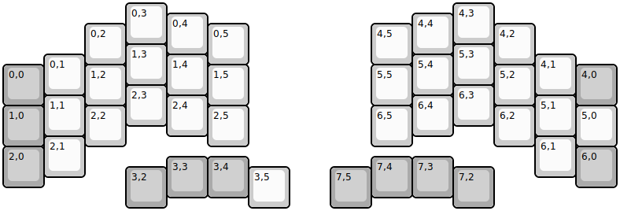
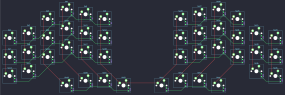

## yoichiro/lunakey-mini

[layout](lunakey-mini-kle.json) - [PCB](lunakey-mini.kicad_pcb)

{:loading="lazy"}

[Open in keyboard-layout-editor](http://www.keyboard-layout-editor.com/##@@_x:3;&=0,3&_x:7;&=4,3;&@_x:4&y:-0.75;&=0,4&_x:5;&=4,4;&@_x:2&y:-0.75;&=0,2&_x:2;&=0,5&_x:3;&=4,5&_x:2;&=4,2;&@_x:3&y:-0.5;&=1,3&_x:7;&=5,3;&@_x:1&y:-0.75;&=0,1&_x:2;&=1,4&_x:5;&=5,4&_x:2;&=4,1;&@_y:-0.75&c=#aaaaaa;&=0,0&_x:1&c=#cccccc;&=1,2&_x:2;&=1,5&_x:3;&=5,5&_x:2;&=5,2&_x:1&c=#aaaaaa;&=4,0;&@_x:3&y:-0.5&c=#cccccc;&=2,3&_x:7;&=6,3;&@_x:1&y:-0.75;&=1,1&_x:2;&=2,4&_x:5;&=6,4&_x:2;&=5,1;&@_y:-0.75&c=#aaaaaa;&=1,0&_x:1&c=#cccccc;&=2,2&_x:2;&=2,5&_x:3;&=6,5&_x:2;&=6,2&_x:1;&=5,0;&@_x:1&y:-0.25;&=2,1&_x:11;&=6,1;&@_y:-0.75&c=#aaaaaa;&=2,0&_x:13;&=6,0;&@_x:4&y:-0.75;&=3,3&=3,4&_x:3;&=7,4&=7,3;&@_x:3&y:-0.75;&=3,2&_x:2&c=#cccccc;&=3,5&_x:1&c=#aaaaaa;&=7,5&_x:2;&=7,2)

{:loading="lazy"}

