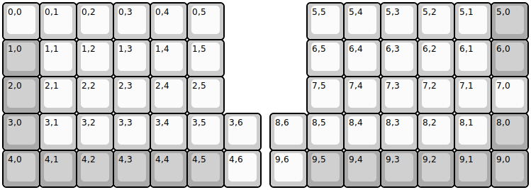
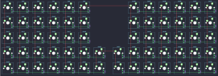

## yushakobo/helix_rev3_5rows

[layout](helix_rev3_5rows-kle.json) - [PCB](helix_rev3_5rows.kicad_pcb)

{:loading="lazy"}

[Open in keyboard-layout-editor](http://www.keyboard-layout-editor.com/##@@=0,0&=0,1&=0,2&=0,3&=0,4&=0,5&_x:2.25;&=5,5&=5,4&=5,3&=5,2&=5,1&_c=#aaaaaa;&=5,0;&@=1,0&_c=#cccccc;&=1,1&=1,2&=1,3&=1,4&=1,5&_x:2.25;&=6,5&=6,4&=6,3&=6,2&=6,1&_c=#aaaaaa;&=6,0;&@=2,0&_c=#cccccc;&=2,1&=2,2&=2,3&=2,4&=2,5&_x:2.25;&=7,5&=7,4&=7,3&=7,2&=7,1&=7,0;&@_c=#aaaaaa;&=3,0&_c=#cccccc;&=3,1&=3,2&=3,3&=3,4&=3,5&=3,6&_x:0.25;&=8,6&=8,5&=8,4&=8,3&=8,2&=8,1&_c=#aaaaaa;&=8,0;&@=4,0&=4,1&=4,2&=4,3&=4,4&=4,5&_c=#cccccc;&=4,6&_x:0.25;&=9,6&_c=#aaaaaa;&=9,5&=9,4&=9,3&=9,2&=9,1&=9,0)

{:loading="lazy"}

