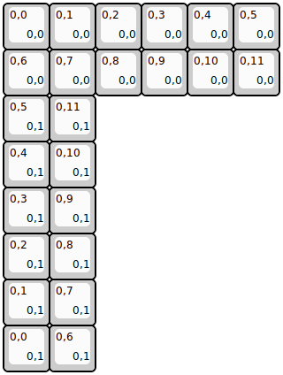
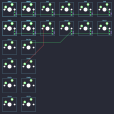

## yynmt/dozen0

[layout](dozen0-kle.json) - [PCB](dozen0.kicad_pcb)

{:loading="lazy"}

[Open in keyboard-layout-editor](http://www.keyboard-layout-editor.com/##@@=0,0%0A%0A%0A0,0&=0,1%0A%0A%0A0,0&=0,2%0A%0A%0A0,0&=0,3%0A%0A%0A0,0&=0,4%0A%0A%0A0,0&=0,5%0A%0A%0A0,0;&@=0,6%0A%0A%0A0,0&=0,7%0A%0A%0A0,0&=0,8%0A%0A%0A0,0&=0,9%0A%0A%0A0,0&=0,10%0A%0A%0A0,0&=0,11%0A%0A%0A0,0;&@=0,5%0A%0A%0A0,1&=0,11%0A%0A%0A0,1;&@=0,4%0A%0A%0A0,1&=0,10%0A%0A%0A0,1;&@=0,3%0A%0A%0A0,1&=0,9%0A%0A%0A0,1;&@=0,2%0A%0A%0A0,1&=0,8%0A%0A%0A0,1;&@=0,1%0A%0A%0A0,1&=0,7%0A%0A%0A0,1;&@=0,0%0A%0A%0A0,1&=0,6%0A%0A%0A0,1)

{:loading="lazy"}

