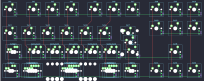

## zicodia/tklfrlnrlmlao

[layout](tklfrlnrlmlao-kle.json) - [PCB](tklfrlnrlmlao.kicad_pcb)

{:loading="lazy"}

[Open in keyboard-layout-editor](http://www.keyboard-layout-editor.com/##@@_c=#777777;&=0,0&_x:0.25&c=#cccccc;&=0,1&=0,2&=0,3&_x:0.25;&=0,4&=0,5&=0,6&_x:0.25;&=0,7&=0,8&=0,9;&@_x:7.75;&=1,7&=1,8&=1,9;&@_y:-0.75&c=#aaaaaa;&=1,0&_c=#cccccc;&=1,1&=1,2&=1,3&=1,4&=1,5&_c=#aaaaaa&w:1.5;&=1,6%0A%0A%0A0,0;&@_w:1.5;&=2,0%0A%0A%0A0,0&_c=#cccccc;&=2,1%0A%0A%0A0,0&=2,2%0A%0A%0A0,0&=2,3%0A%0A%0A0,0&=2,4%0A%0A%0A0,0&=2,5%0A%0A%0A0,0&_c=#aaaaaa;&=2,6%0A%0A%0A0,0&_x:1.25&c=#777777;&=2,8;&@_c=#aaaaaa&w:1.25;&=3,0%0A%0A%0A1,0&=3,1%0A%0A%0A1,0&_c=#cccccc&w:3;&=3,3%0A%0A%0A1,0&_c=#aaaaaa;&=3,5%0A%0A%0A1,0&_w:1.25;&=3,6%0A%0A%0A1,0&_x:0.25&c=#777777;&=3,7&=3,8&=3,9;&@_x:6.25&y:0.5&w:1.25&h:2&w2:1.5&h2:1&x2:-0.25;&=2,6%0A%0A%0A0,1;&@_c=#cccccc&w:1.25;&=2,0%0A%0A%0A0,1&=2,1%0A%0A%0A0,1&=2,2%0A%0A%0A0,1&=2,3%0A%0A%0A0,1&=2,4%0A%0A%0A0,1&=2,5%0A%0A%0A0,1;&@_y:0.25&c=#aaaaaa;&=3,0%0A%0A%0A1,1&=3,1%0A%0A%0A1,1&_c=#cccccc&w:3;&=3,3%0A%0A%0A1,1&_c=#aaaaaa&w:1.25;&=3,5%0A%0A%0A1,1&_w:1.25;&=3,6%0A%0A%0A1,1;&@=3,0%0A%0A%0A1,2&_w:1.25;&=3,1%0A%0A%0A1,2&_c=#cccccc&w:3;&=3,3%0A%0A%0A1,2&_c=#aaaaaa&w:1.25;&=3,5%0A%0A%0A1,2&=3,6%0A%0A%0A1,2;&@_w:1.25;&=3,0%0A%0A%0A1,3&_w:1.25;&=3,1%0A%0A%0A1,3&_c=#cccccc&w:2.75;&=3,3%0A%0A%0A1,3&_c=#aaaaaa&w:1.25;&=3,5%0A%0A%0A1,3&=3,6%0A%0A%0A1,3;&@_w:1.25;&=3,0%0A%0A%0A1,4&_w:1.25;&=3,1%0A%0A%0A1,4&_c=#cccccc&w:3;&=3,3%0A%0A%0A1,4&_c=#aaaaaa;&=3,5%0A%0A%0A1,4&=3,6%0A%0A%0A1,4;&@_w:1.25;&=3,0%0A%0A%0A1,5&=3,1%0A%0A%0A1,5&_c=#cccccc&w:2.75;&=3,3%0A%0A%0A1,5&_c=#aaaaaa&w:1.25;&=3,5%0A%0A%0A1,5&_w:1.25;&=3,6%0A%0A%0A1,5;&@_w:1.25;&=3,0%0A%0A%0A1,6&_x:1.0&c=#cccccc&w:3;&=3,3%0A%0A%0A1,6&_x:1.0&c=#aaaaaa&w:1.25;&=3,6%0A%0A%0A1,6)

{:loading="lazy"}

